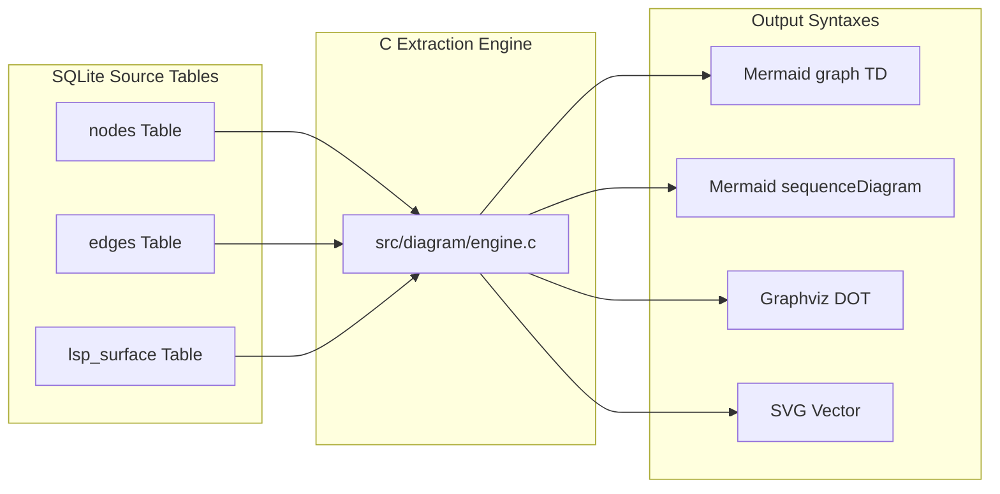

# Product Requirement Document (PRD)

## Native Diagram & Architecture Generation from SQLite Knowledge Graph

| **Document Metadata** | **Details** |
|---|---|
| **Feature Name** | Native Graph Diagram Generation (`export_diagram` & `cbm diagram`) |
| **Product** | `codebase-memory-mcp` |
| **Status** | Proposed / Draft |
| **Target Release** | v0.12.0 |
| **Author** | Google DeepMind Antigravity / Pair Programming |
| **Dependencies** | SQLite (`store.c`), AST Indexing (`pipeline.c`), MCP Dispatch (`mcp.c`) |
| **External Dependencies** | **None** (Zero Node.js, Zero Python, Zero Git requirement) |

---

## 1. Executive Summary & Problem Statement

### 1.1 The Problem
AI coding agents (Cursor, Claude Code, Codex, Antigravity, Copilot) frequently need structural and behavioral diagrams (Architecture, Call Sequence, Data Flow, and Package Dependencies) to reason about codebases, plan modifications, and generate documentation.

Currently, agents generate diagrams through two suboptimal approaches:
1. **Pure LLM Generation**: The agent reads raw source files, burning hundreds of thousands of context window tokens, and attempts to write Mermaid syntax from memory. This is slow, non-deterministic, and prone to hallucinations (missing calls, inventing nonexistent methods).
2. **Heavy External Toolchains (e.g., Archify)**: Tools like Archify provide validated, beautiful diagrams, but require external Node.js runtimes, headless browser checks (Playwright), JSON schema validators, and Git commit auditing.

### 1.2 The Solution
`codebase-memory-mcp` already parses 162 languages into an in-memory, sub-millisecond SQLite knowledge graph containing exact AST nodes (`Function`, `Class`, `Route`, `File`, `Package`), call relationships (`CALLS`, `HTTP_CALLS`), data access (`READS`, `WRITES`), and cross-file type resolution (`Hybrid LSP`).

This feature introduces **Native Diagram Generation**:
* A pure C rendering engine embedded directly within the native binary.
* Directly queries the local SQLite instance (`nodes`, `edges`, `lsp_surface`).
* Emits standard, validated diagram formats (**Mermaid**, **Graphviz DOT**, and lightweight **SVG**) in under **10 milliseconds** with **zero LLM token consumption** and **zero Git dependency**.

---

## 2. Goals & Non-Goals

### 2.1 Goals
* **G-1: Pure Native Implementation**: Implemented entirely in C99, compiled into the existing single native binary (`codebase-memory-mcp`). Zero runtime dependencies.
* **G-2: Deterministic & Verified**: Every node and edge originates directly from Tree-Sitter AST and Hybrid LSP analysis. No hallucinated symbols or phantom call paths.
* **G-3: Markdown-Native Formats**: Primary output is Markdown-compatible **Mermaid** (`graph TD`, `sequenceDiagram`, `flowchart LR`), viewable natively in GitHub, VS Code, Cursor, Obsidian, and browser previews.
* **G-4: Dual Access Surfaces**: Expose functionality via both:
  1. MCP Tool: `export_diagram` (for automated agent consumption).
  2. CLI Command: `codebase-memory-mcp diagram [type] [options]` (for scripts, CI/CD, and developers).
* **G-5: Sub-10ms Latency SLA**: Capable of generating architecture and sequence diagrams on repositories with >100,000 LOC in under 10ms.

### 2.2 Non-Goals
* **NG-1: Replacing the 3D WebGL UI**: The existing `localhost:9749` interactive Three.js viewer remains the primary 3D spatial visualizer. This feature focuses on documentation-ready 2D vector/text diagrams.
* **NG-2: Runtime Memory Profiling**: This feature visualizes static AST and Hybrid LSP relationships, not dynamic runtime thread states or heap dumps.
* **NG-3: Full Infrastructure-as-Code Diagramming**: While Kubernetes and Dockerfile AST nodes exist in the graph, this feature focuses on code topology and service boundaries, not cloud infrastructure provisioning.

---

## 3. User Personas & Core Use Cases

### 3.1 Personas
* **AI Coding Agent**: Wants an immediate topological map or sequence trace of a subsystem before proposing code edits, consuming < 500 tokens instead of reading 20 files.
* **Software Architect / Tech Lead**: Needs instant, drift-free architecture diagrams generated during CI/CD or PR reviews.
* **Onboarding Developer**: Needs to understand how an API request flows through handlers, services, and database tables.

### 3.2 User Stories
* **US-1**: *As an AI agent*, I want to call `export_diagram(type="sequence", entry_point="handle_checkout")` so I can see the exact chronological function call sequence without parsing 15 source files.
* **US-2**: *As a developer*, I want to run `cbm diagram architecture --format=mermaid > ARCHITECTURE.md` in a GitHub Action so our repository documentation never drifts from the actual code.
* **US-3**: *As an agent*, I want to call `export_diagram(type="dataflow", route="POST /api/v1/orders")` to identify which tables are read and written by that route before performing a schema migration.

---

## 4. Supported Diagram Types & Extraction Rules



### 4.1 Architecture Diagram (`type="architecture"`)
* **Objective**: High-level component and subsystem dependency map.
* **Extraction Source**:
  * Utilizes existing C API: `cbm_store_get_architecture(store, project, ..., &arch)` in [`src/mcp/mcp.c:L7485`](file:///c:/AI/Source/storm/codebase-memory-mcp-main/src/mcp/mcp.c#L7485).
  * Nodes aggregated by `Package` or `Folder`.
  * Edges filtered by `IMPORTS` (cross-package dependencies) and `HTTP_CALLS` / `ASYNC_CALLS`.
  * Integrates Tarjan's Strongly-Connected Components (SCC) to flag circular package dependencies in red.
* **Sample Mermaid Output**:
  ```mermaid
  graph TD
      subgraph Frontend ["Frontends & Transport"]
          mcp["src/mcp (stdio JSON-RPC)"]
          ui["src/ui (HTTP :9749)"]
      end
      subgraph Core ["Core Engine"]
          daemon["src/daemon (IPC Socket)"]
          pipeline["src/pipeline (Worker Pool)"]
          cypher["src/cypher (Query Planner)"]
      end
      subgraph Storage ["Persistence"]
          store["src/store (SQLite WAL)"]
      end
      mcp -->|IPC| daemon
      daemon --> pipeline
      mcp -->|query| cypher
      cypher --> store
  ```

---

### 4.2 Call Sequence Diagram (`type="sequence"`)
* **Objective**: Chronological caller-to-callee trace starting from an entry point.
* **Parameters**:
  * `entry_point` (required): Function qualified name (e.g., `handle_layout`) or route name.
  * `max_depth` (optional, default `3`): Traversal hop limit.
  * `max_participants` (optional, default `8`): Participant width cap.
* **Extraction Algorithm**:
  1. Locate root node $N_{root}$ in `nodes` table by `qualified_name` or `name`.
  2. Query outbound `edges` where `source_id = N_root.id` and `type = 'CALLS'`.
  3. Sort callees by `call.start_line` to preserve actual lexical execution order.
  4. Recursively traverse child callees up to `max_depth`.
  5. Assign participants based on distinct source files or classes.
* **Sample Mermaid Output**:
  ```mermaid
  sequenceDiagram
      autonumber
      participant H as http_server.c
      participant L as layout3d.c
      participant S as store.c
      H->>L: cbm_layout_compute(scoped_project)
      activate L
      L->>S: cbm_store_search(params)
      S-->>L: search_out (nodes array)
      L->>S: cbm_store_batch_count_degrees(CALLS)
      S-->>L: in_calls count
      L-->>H: cbm_layout_result_t
      deactivate L
      H->>H: cbm_layout_to_json(layout)
  ```

---

### 4.3 Data Flow Diagram (`type="dataflow"`)
* **Objective**: Traces data ingestion from entry points through transformations to persistent storage.
* **Extraction Algorithm**:
  1. Identify source endpoints: `nodes` with `label='Route'` (e.g. `POST /api/orders`) or CLI entry points.
  2. Follow `CALLS` and `HANDLES` edges to service handler functions.
  3. Inspect `edges` with `type='READS'` and `type='WRITES'` (populated by `pass_semantic_edges.c`).
  4. Query `lsp_surface` to extract input argument types and return types.
  5. Group into 4 canonical stages: `Ingress` $\to$ `Transform` $\to$ `Storage` $\to$ `Egress`.

---

### 4.4 Module & Package Dependency DAG (`type="dependencies"`)
* **Objective**: Visual audit of import hierarchies, dead packages, and dependency cycles.
* **Extraction Source**:
  * Direct extraction from `nodes WHERE label='Package'` and `edges WHERE type='IMPORTS'`.

---

## 5. Interface Specifications

### 5.1 MCP Tool: `export_diagram`

#### Tool Registration Schema (`src/mcp/mcp.c`)
```json
{
  "name": "export_diagram",
  "description": "Generate deterministic architecture, sequence, and dataflow diagrams directly from the SQLite knowledge graph. Returns Mermaid syntax or SVG.",
  "inputSchema": {
    "type": "object",
    "required": ["type"],
    "properties": {
      "type": {
        "type": "string",
        "enum": ["architecture", "sequence", "dataflow", "dependencies"],
        "description": "The category of diagram to construct."
      },
      "entry_point": {
        "type": "string",
        "description": "Target symbol or route for sequence/dataflow diagrams (e.g. 'cbm_layout_compute' or 'POST /api/orders')."
      },
      "scope_path": {
        "type": "string",
        "description": "Optional repository-relative subfolder to constrain diagram scope (e.g. 'src/pipeline')."
      },
      "format": {
        "type": "string",
        "enum": ["mermaid", "dot", "svg"],
        "default": "mermaid",
        "description": "Output syntax format."
      },
      "max_depth": {
        "type": "integer",
        "default": 3,
        "minimum": 1,
        "maximum": 8,
        "description": "Maximum call stack traversal depth for sequence diagrams."
      }
    }
  }
}
```

#### Tool Response Structure
```json
{
  "diagram_type": "sequence",
  "format": "mermaid",
  "entry_point": "cbm_layout_compute",
  "nodes_analyzed": 42,
  "edges_traversed": 68,
  "content": "sequenceDiagram\n    autonumber\n    ..."
}
```

---

### 5.2 CLI Command Line Interface

```bash
# Generate high-level system architecture as Mermaid
codebase-memory-mcp diagram architecture

# Generate sequence diagram for a specific function
codebase-memory-mcp diagram sequence --entry=cbm_layout_compute --depth=3

# Output directly to a file
codebase-memory-mcp diagram architecture --format=mermaid -o docs/ARCHITECTURE.md

# Generate Graphviz DOT format for pipeline integration
codebase-memory-mcp diagram dependencies --scope=src/pipeline --format=dot | dot -Tpng -o pipeline.png
```

---

## 6. Technical Architecture & Implementation Plan

### 6.1 Directory & Module Structure
A new dedicated C module: `src/diagram/`:

```
src/diagram/
├── diagram.h          # Public API and data structures
├── diagram.c          # Top-level dispatcher and query orchestrator
├── query_sequence.c   # Recursive SQL/BFS for call ordering
├── query_arch.c       # Layer condensation and package grouping
├── query_flow.c       # READS/WRITES dataflow path tracer
├── emit_mermaid.c     # Fast arena-backed Mermaid text formatter
├── emit_dot.c         # Graphviz DOT formatter
└── sanitize.c         # Node name and string literal escaping
```

### 6.2 Data Query Engine (Zero-Allocation Buffer Pattern)
To maintain the high performance standards of `codebase-memory-mcp`:
1. **Prepared SQL Statements**: Pre-compile traversal queries in `cbm_store_t` initialization:
   ```sql
   /* Stmt: CBM_STMT_DIAGRAM_SEQUENCE */
   SELECT e.target_id, n_target.name, n_target.file_path, 
          json_extract(e.properties, '$.call_line') AS line_num
   FROM edges e
   JOIN nodes n_target ON e.target_id = n_target.id
   WHERE e.source_id = ? AND e.type = 'CALLS'
   ORDER BY line_num ASC;
   ```
2. **Arena Allocation**: Build Mermaid output strings into a temporary memory arena (`cbm_arena_t`), formatted in a single contiguous memory block and freed upon tool completion.

### 6.3 Name & Character Sanitization
Mermaid and DOT syntaxes fail if node labels contain special characters (`::`, `.`, `-`, `<`, `>`, quotes).
* Implement `cbm_diagram_sanitize_id(const char *raw, char *buf, size_t cap)`:
  * Converts `pkg/orders.OrderHandler::Process` $\to$ `pkg_orders_OrderHandler_Process`.
  * Places raw readable text inside quoted labels: `id["pkg/orders.OrderHandler::Process"]`.

---

## 7. Performance & Security Requirements

| Metric | Target | Rationale |
|---|---|---|
| **Query Latency** | $< 10\text{ ms}$ | Must execute instantaneously during interactive AI agent tool calling loops |
| **Memory Footprint** | $< 4\text{ MB}$ | Temporary arena buffer; released immediately after generation |
| **Disk I/O** | **0 bytes** | Read-only against SQLite; no temporary files created on disk |
| **Token Efficiency** | $< 600\text{ tokens}$ | Mermaid output is 98% smaller than passing raw source files to LLMs |
| **Security** | 100% Offline | Zero external HTTP requests; zero data leaves the local machine |

---

## 8. Rollout Plan & Milestones

### Phase 1: Core Engine & Sequence Extraction (Week 1–2)
* Implement `src/diagram/query_sequence.c` and `emit_mermaid.c`.
* Unit tests on CBM codebase itself tracing `main` $\to$ `cbm_alloc_init` $\to$ `cbm_daemon_process_role`.

### Phase 2: Architecture & Package Grouping (Week 3)
* Connect `cbm_store_get_architecture` aspects to `query_arch.c`.
* Support package subgraphs and cross-package dependency arrows.

### Phase 3: MCP Tool & CLI Integration (Week 4)
* Register `export_diagram` in `src/mcp/mcp.c`.
* Wire CLI handler in `src/cli/cli.c`.
* End-to-end integration tests with Cursor and Codex CLI.

---

## 9. Verification & Acceptance Criteria

1. **Self-Hosting Verification**:
   Running `cbm diagram architecture` against `codebase-memory-mcp` itself produces valid Mermaid syntax that renders cleanly in GitHub and VS Code preview without syntax errors.
2. **Deterministic Sequence Test**:
   Calling `export_diagram(type="sequence", entry_point="handle_layout")` returns all 5 child calls in the exact order written in [`src/ui/http_server.c:L1541-1561`](file:///c:/AI/Source/storm/codebase-memory-mcp-main/src/ui/http_server.c#L1541-L1561).
3. **Zero Git Reliance**:
   Deleting the `.git` folder from a test project and generating diagrams succeeds without warning or error.
4. **Benchmarking**:
   Benchmark test verifies $< 10\text{ms}$ execution time on SQLite databases with $> 500,000$ indexed edges.
