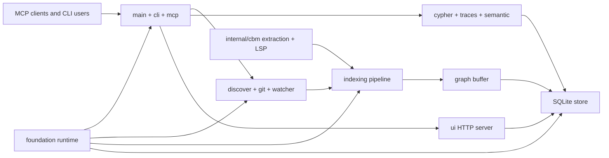

# Architecture

## System shape

codebase-memory-mcp is a local C11 application. One binary provides command-line
operations, an MCP JSON-RPC server, repository indexing, SQLite-backed graph
queries, background synchronization, and an optional embedded graph UI.

## Runtime shelves

| Shelf | Boundary |
| --- | --- |
| `src/foundation` | Portable runtime services. Higher layers may depend on it; it should not depend on product orchestration. |
| `src/discover`, `src/git`, `src/watcher` | Locate source files, interpret repository state, and schedule refreshes. |
| `internal/cbm` | Parse source through vendored tree-sitter grammars and language-specific extraction or LSP resolution. |
| `src/pipeline` | Orchestrate extraction and convert results into graph nodes and edges. |
| `src/graph_buffer` | Accumulate graph changes before persistence. |
| `src/store` | Own SQLite schema, storage, search, traversal, architecture data, and ADR persistence. |
| `src/cypher`, `src/traces`, `src/semantic`, `src/simhash` | Query, trace, semantic relation, and clone-analysis services over the graph. |
| `src/mcp` | Expose the product through JSON-RPC and the 15 MCP tools. |
| `src/cli` | Expose commands and manage supported client configuration. |
| `src/ui`, `graph-ui/src` | Serve and render the optional local graph interface. |

The generated [repository index](REPOSITORY_INDEX.md) lists every direct file in
each product module.

## Indexing data flow

1. Discovery applies built-in exclusions, Git ignore rules, `.cbmignore`, and
   user configuration.
2. `internal/cbm` parses each supported file and returns definitions, calls,
   imports, usages, routes, and language metadata.
3. Pipeline passes normalize identities, resolve relationships, add semantic and
   infrastructure facts, and prepare graph changes.
4. The graph buffer batches nodes and edges.
5. The store writes project-scoped SQLite records and maintains search indexes.
6. MCP, CLI, and UI queries read through store, Cypher, trace, and semantic APIs.

## Source, generated, and vendored boundaries

- First-party product code lives under `src`, `internal/cbm` outside its
  `vendored` subtree, `graph-ui/src`, `scripts`, and `tests`.
- `internal/cbm/vendored/grammars` contains 159 pinned tree-sitter grammar
  sources. Grammar wrappers live directly under `internal/cbm`.
- Root `vendored` contains pinned native libraries needed for the self-contained
  binary promise.
- Build products belong under `build` or `graph-ui/dist`. Coverage, TypeScript
  build metadata, Python bytecode, and dependency folders are not source.
- Distribution wrappers live under `pkg`; root `VERSION` and
  `pkg/release-checksums.json` are their checked-in release facts.
- The release workflow rejects a dispatch version that differs from root
  `VERSION`, then re-runs version and checksum parity before building artifacts.

## Test boundaries

Required C suites live directly under `tests` and run through one test runner.
Every `test_*.c` file must appear in `Makefile.cbm`; every suite must be declared
and called in `tests/test_main.c`. `scripts/check-test-registration.py` enforces
that contract. Open-bug reproduction cases live under `tests/repro` and remain a
separate runner. Frontend tests live beside the TypeScript modules they cover.

## Graph-guided module decision

The 2026-07-17 full Memory MCP index found that the remaining large translation
units are central integration hubs. High fan-in functions include
`cbm_free_result`, `cbm_store_close`, and `cbm_store_open_memory`. Current main
already extracts cohesive CLI configuration editors, agent-client logic, MCP
output and supervisor helpers, and foundation services into focused files.

This organization pass therefore keeps the current module shelves and improves
their catalog and automated boundaries. A future split of `cli.c`, `mcp.c`,
`store.c`, `cypher.c`, or language extraction hubs must be a separate
behavior-preserving refactor. Before moving code, it should:

1. reindex the current branch in full mode;
2. trace callers and callees of the proposed seam, including tests;
3. capture change impact from the target base branch;
4. move one cohesive responsibility while preserving public headers;
5. run focused suites, the full suite, static checks, and a post-change reindex.

This decision favors a reliable catalog over a directory reshuffle that could
change product behavior.

## Ownership and change control

`.github/CODEOWNERS` defines the binding owner gate. `MAINTAINERS.md` provides
the more detailed review and release map. Security, workflow, release,
distribution, installer, vendored, and MCP protocol changes remain high-risk
surfaces under those policies.

`docs/repository-layout.json` is the machine-readable shelf contract. Every
top-level shelf, root file, product module, and package shelf must be declared
there with a purpose and owner before the organization gate accepts it.
