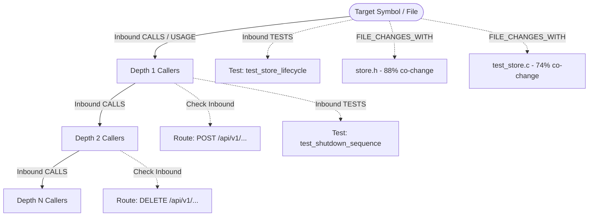

# RFC 001: `analyze_blast_radius` — Impact, Ingress Exposure & Test Safety Net Analysis

- **RFC Number:** 001
- **Title:** `analyze_blast_radius` — Blast Radius, Ingress Route Exposure, and Test Safety Net Analyzer
- **Status:** Proposed
- **Author:** Codebase Memory Architecture Team
- **Target Subsystem:** `src/mcp/`, `src/store/`, `src/cli/`, `graph-ui/`
- **Target Version:** v0.12.0
- **Created:** 2026-10-04

---

## 1. Executive Summary & Problem Statement

### 1.1 The Problem
When developers or AI coding assistants (such as Claude Code, Cursor, or Antigravity) are tasked with refactoring, fixing bugs, or modifying code in a medium-to-large repository, their primary concern is risk:
1. **What downstream code breaks if I change this function or file?**
2. **Does this function sit behind a public API route or network ingress point?**
3. **Do automated tests actually protect this change, or am I flying blind?**
4. **What other non-code files (schemas, configs, tests) historically change whenever this code is touched?**

Currently, `codebase-memory-mcp` exposes `trace_path`, which performs raw caller/callee path tracing. However:
- `trace_path` treats all inbound edges uniformly, without distinguishing between internal helper functions, public ingress API routes, and test functions.
- An agent must execute 4 to 6 separate tool calls (`trace_path`, multiple `search_graph` queries, git log searches, and file greps) to reconstruct the blast radius of a single proposed edit.
- This high friction leads agents to skip impact analysis, resulting in broken upstream call sites, unexpected regressions in public endpoints, and unverified refactorings.

### 1.2 The Solution
Introduce a dedicated MCP tool: `analyze_blast_radius`.
This tool performs a unified multi-hop graph traversal starting from a target symbol or file, simultaneously resolving:
- **Transitive Impact Graph**: Downstream dependents across `CALLS`, `USAGE`, and `IMPORTS`.
- **Public Ingress Exposure**: Direct and indirect reachability from `Route` nodes (e.g., `POST /api/checkout`).
- **Test Safety Net**: Which `TESTS` and `TESTS_FILE` edges connect into the affected subgraph, calculating a test protection ratio.
- **Commit Co-Change Coupling**: Companion files identified via `FILE_CHANGES_WITH` edges.
- **Composite Risk Score**: A 0.0–1.0 score factoring in depth, fan-in, public endpoint reachability, and test absence.

---

## 2. Existing SQLite Database Assets (Zero Reindexing Required)

The SQLite database already contains all required nodes, edges, and properties:

| Database Entity | Field / Type | Role in Blast Radius Calculation |
| :--- | :--- | :--- |
| `nodes` | `label = 'Route'` | Ingress API entry points with `url_path` and `method` in `properties` |
| `nodes` | `label = 'Function'`, `label = 'Class'` | Internal code symbols with `properties.importance` |
| `edges` | `type = 'CALLS'` | Upstream caller call chains |
| `edges` | `type = 'USAGE'` | Type reference and variable usage dependencies |
| `edges` | `type = 'IMPORTS'` | Module-level file dependencies |
| `edges` | `type = 'TESTS'` | Test functions mapped to the production functions they verify |
| `edges` | `type = 'TESTS_FILE'` | Test files linked to production files |
| `edges` | `type = 'FILE_CHANGES_WITH'` | Temporal co-change confidence and commit count from git history |

---

## 3. Tool Specification (MCP JSON-RPC)

### 3.1 Tool Registration
- **Name:** `analyze_blast_radius`
- **Description:** Computes the comprehensive change blast radius of a symbol or file: identifies all transitive upstream callers, public API routes exposed, test suites covering the call tree, historically co-changing companion files, and an overall risk index.

### 3.2 Input Parameters (`inputSchema`)

```json
{
  "type": "object",
  "properties": {
    "project": {
      "type": "string",
      "description": "Target project identifier registered in Codebase Memory."
    },
    "target": {
      "type": "string",
      "description": "Qualified symbol name (e.g. 'cbm_store_close') or relative file path (e.g. 'src/store/store.c')."
    },
    "max_depth": {
      "type": "integer",
      "default": 3,
      "minimum": 1,
      "maximum": 10,
      "description": "Maximum traversal depth for upstream callers and usages."
    },
    "include_co_changes": {
      "type": "boolean",
      "default": true,
      "description": "Include companion files historically committed together via FILE_CHANGES_WITH edges."
    },
    "format": {
      "type": "string",
      "enum": ["summary", "detailed", "json"],
      "default": "detailed",
      "description": "Output detail level: summary (metrics & risk), detailed (full lists), json (raw graph)."
    }
  },
  "required": ["project", "target"]
}
```

### 3.3 Output Response Structure

```json
{
  "target": "cbm_store_close",
  "target_type": "Function",
  "file_path": "src/store/store.c",
  "line_range": [688, 712],
  "risk_assessment": {
    "score": 0.82,
    "level": "HIGH",
    "rationale": "High downstream caller fan-in (14 symbols) reaching 2 public Route endpoints, with only 1 direct unit test suite."
  },
  "metrics": {
    "affected_symbols_count": 14,
    "affected_files_count": 5,
    "exposed_routes_count": 2,
    "covering_tests_count": 1,
    "test_coverage_ratio": 0.071
  },
  "exposed_routes": [
    {
      "method": "POST",
      "url_path": "/api/v1/projects/:name/unload",
      "handler": "handle_unload_project",
      "distance": 2,
      "file_path": "src/ui/http_server.c",
      "line": 412
    },
    {
      "method": "DELETE",
      "url_path": "/api/v1/projects/:name",
      "handler": "handle_delete_project",
      "distance": 3,
      "file_path": "src/ui/http_server.c",
      "line": 560
    }
  ],
  "covering_tests": [
    {
      "test_symbol": "test_store_lifecycle",
      "test_file": "tests/test_store.c",
      "line": 145,
      "test_type": "direct_call"
    }
  ],
  "affected_symbols": [
    {
      "qualified_name": "src.main.cbm_shutdown",
      "file_path": "src/main.c",
      "distance": 1,
      "edge_type": "CALLS",
      "importance": 8.42
    },
    {
      "qualified_name": "src.mcp.mcp.cbm_mcp_server_free",
      "file_path": "src/mcp/mcp.c",
      "distance": 1,
      "edge_type": "CALLS",
      "importance": 12.1
    }
  ],
  "git_co_changes": [
    {
      "file_path": "src/store/store.h",
      "co_commit_count": 48,
      "confidence": 0.88
    },
    {
      "file_path": "tests/test_store.c",
      "co_commit_count": 32,
      "confidence": 0.74
    }
  ]
}
```

---

## 4. Graph Algorithm & Traversal Mechanics



### 4.1 Risk Scoring Formula
The composite risk score $R \in [0.0, 1.0]$ is computed as:
$$R = \min\left(1.0, \; 0.35 \cdot \log_{10}(S + 1) + 0.30 \cdot \min(1.0, R_{exp}) + 0.25 \cdot (1.0 - C_{test}) + 0.10 \cdot \min(1.0, F_{coupled})\right)$$
Where:
- $S$: Count of transitive affected symbols.
- $R_{exp}$: Count of exposed public routes divided by 2 (capped at 1.0).
- $C_{test}$: Test coverage ratio: $\frac{|\text{covered symbols}|}{S}$.
- $F_{coupled}$: Number of companion files with co-change confidence $> 0.5$.

---

## 5. C Backend Implementation

### 5.1 Store Layer Queries (`src/store/store.c`)

```c
/* Traverse upstream callers and collect node IDs up to max_depth */
int cbm_store_blast_radius(cbm_store_t *s, const char *project, int64_t target_id,
                           int max_depth, cbm_blast_radius_result_t **out);
```

#### SQL Implementation Strategy
Using an in-memory SQLite recursive common table expression (CTE):

```sql
WITH RECURSIVE upstream(node_id, depth, path) AS (
    SELECT ?1, 0, CAST(?1 AS TEXT)
    UNION
    SELECT e.source_id, u.depth + 1, u.path || '->' || CAST(e.source_id AS TEXT)
    FROM edges e
    JOIN upstream u ON e.target_id = u.node_id
    WHERE e.project = ?2
      AND e.type IN ('CALLS', 'USAGE', 'IMPORTS')
      AND u.depth < ?3
      AND instr(u.path, CAST(e.source_id AS TEXT)) = 0 -- Cycle prevention
)
SELECT u.node_id, u.depth, n.name, n.qualified_name, n.label, n.file_path,
       n.start_line, n.end_line, n.properties
FROM upstream u
JOIN nodes n ON u.node_id = n.id;
```

#### Parallel Lookup for Tests & Routes
Once the upstream node IDs are collected into a temporary set:
1. **Routes Query:**
   ```sql
   SELECT DISTINCT r.id, r.name, r.file_path, r.properties, u.depth
   FROM edges e
   JOIN nodes r ON e.source_id = r.id AND r.label = 'Route'
   JOIN temp_affected u ON e.target_id = u.node_id
   WHERE e.project = ?1;
   ```
2. **Tests Query:**
   ```sql
   SELECT DISTINCT t.id, t.name, t.file_path, t.start_line, e.target_id
   FROM edges e
   JOIN nodes t ON e.source_id = t.id AND (e.type = 'TESTS' OR json_extract(t.properties, '$.is_test') = 1)
   JOIN temp_affected u ON e.target_id = u.node_id
   WHERE e.project = ?1;
   ```
3. **Git History Coupling Query:**
   ```sql
   SELECT target_id, json_extract(properties, '$.confidence') AS conf,
          json_extract(properties, '$.co_commits') AS commits
   FROM edges
   WHERE project = ?1 AND source_id = ?2 AND type = 'FILE_CHANGES_WITH'
   ORDER BY conf DESC LIMIT 10;
   ```

---

## 6. CLI & UI Integration

### 6.1 CLI Command
```bash
cbm cli analyze_blast_radius --project codebase-memory-mcp-ui --target cbm_store_close --max-depth 3
```

### 6.2 UI Integration (`graph-ui`)
- **NodeDetailPanel**: Add an interactive "💥 Blast Radius" button.
- **GraphScene 3D View**:
  - Highlights the target node in vibrant Amber (`#f59e0b`).
  - Colors affected upstream callers in gradient Cyan (`#06b6d4`).
  - Highlights exposed `Route` nodes in glowing Red (`#ef4444`).
  - Highlights covering test suites in Emerald Green (`#10b981`).
  - Dims all unrelated nodes to 10% opacity for instant visual clarity.

---

## 7. Security, Performance & Scalability

- **Read-Only Safety**: Traversal executes with `SQLITE_OPEN_READONLY`.
- **Query Latency**: Traversal runs in sub-15ms for graphs up to 100,000 nodes due to primary key and index coverage (`idx_edges_target_type`, `idx_nodes_project_qn`).
- **Resource Bounds**: Recursion depth is capped at 10 hops; maximum nodes evaluated capped at 1,000 to prevent runaway memory allocation.

---

## 8. Acceptance Criteria & Test Plan

1. **Unit Tests (`tests/test_mcp.c`)**:
   - `test_blast_radius_single_leaf`: Leaf function with 1 caller returns depth 1 and test coverage.
   - `test_blast_radius_route_reachability`: Verifies that a function called by a controller returns the controller's `Route` node.
   - `test_blast_radius_cycle_handling`: Verifies recursive callers terminate without infinite loops.
2. **End-to-End MCP Integration**:
   - Verify tool output JSON satisfies schema when called from an MCP client against a known repo.
