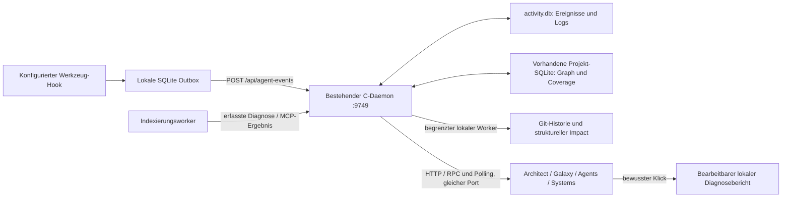

# PR 2068: implementierter Stand und Abnahme

**Korrigierte Abnahmebewertung:** Der anschließende
[direkte Produktvergleich](pr-2068-product-audit.md) zeigt wesentliche offene
Nutzerabläufe und Integrationslücken. Der ursprüngliche Auftrag ist nicht
abgeschlossen. Die folgenden Nachweise belegen implementierte Bausteine;
sie sind kein Nachweis einer bereits ausreichend verständlichen Repository-Karte.

Stand: 9. September 2026. Implementierung auf `feat/codeatlas-web`, Basis des PR
`feat/atlas-r1`, ursprünglicher HEAD `80f4f41f9bcb9daf60afc5f607bcbcba24a4b196`.
Die Änderungen liegen lokal im vorgesehenen Branch. Kein Push, keine Änderungen
an anderen Branches, keine Accounts, Uploads oder Issue-Erstellung.

Nach dem ersten Abnahmestand wurde die vom Nutzer gemeldete Vermischung alter
Testfehler mit dem ausgewählten Projekt korrigiert. Der
[Feedback-Bericht](pr-2068-feedback-fixes.md) dokumentiert die anschließend
implementierte Projektzuordnung, Historienansicht und vollständige Coverage-
Pagination einschließlich neuer Browserprüfungen. Die ursprünglichen Testläufe
unten bleiben als zeitlich zugeordnete Nachweise erhalten.

## Nutzwert und tatsächliche Umsetzung

| Entwicklerfrage | Implementierte Antwort und nächste Handlung | Evidenz / Grenzen |
| --- | --- | --- |
| Was macht dieses Repository, wo beginne ich? | Architect öffnet mit Repository-Karte, direktem README-Einstieg, indexierten Einstiegskandidaten und verbundenen Quellbereichen. Bereich → Datei → Symbol; vorhandene Übersicht, Routen, Hotspots und Import-Lesereihenfolge bleiben erreichbar. | README und tatsächliche Quellpositionen. Quellbereiche sind ausdrücklich heuristische Navigationsgruppen; keine behaupteten fachlichen Grenzen oder Ausführungsreihenfolgen. |
| Wie arbeiten Bereiche zusammen? | Getrennte eingehende/ausgehende Beziehungen nach Kantentyp. Aggregierte Verbindungen lassen sich bis zu einzelnen Kanten, Deklarationen und erfassten Aufrufzeilen aufklappen. | SQLite-Kanten mit Identitäten. CALLS, IMPORTS, USAGE und Typbeziehungen bleiben unterscheidbar; keine Umdeutung von Imports zu Datenfluss. |
| Warum ist meine Auswahl relevant? | Auswahlkontext zeigt Caller, Beziehungen und begrenzte statische Pfade ab Einstiegskandidaten. Quellcode-Link und Impact folgen derselben Auswahl. | Graphbefunde und tatsächlich erfasste Werkzeugereignisse sind getrennt. Fehlende Verbindungen erzeugen einen ehrlichen Leerzustand; keine LLM-Abhängigkeit. |
| Was könnte eine Änderung betreffen? | Integriertes Change-Impact-Widget für Datei oder Symbol: priorisierte direkte/transitive Abhängigkeiten, aufklappbare Graphpfade, Testkandidaten, separate Git-Co-Changes und nächste Prüfungen. | Transparente Heuristik und eigenständige Datenqualitätsanzeige; kein Prozentwert für Defekte. Git-Befunde führen zu konkreten Hashes und kopierbaren lokalen Prüfkommandos. |
| Welche Arbeit wurde tatsächlich beobachtet? | Agent Overview liest das persistierte Journal über den Daemon. Ereignisse bleiben nach Wiederverbindung/Neustart erhalten und führen zur betroffenen Quelle. | Der bestehende Werkzeug-Hook ist die Ereignisquelle; Einrichtung bleibt erforderlich. Ein Werkzeugaufruf beweist keine Absicht und kein erfolgreiches Ergebnis. |
| Ist die Karte unvollständig oder ein Indexierungsauftrag gescheitert? | Gemeinsame priorisierte Fehleranzeige in allen Workspaces, Systems-Jobstatus und explizit geöffnete lokale Diagnose. Vorhandene Coverage-Kategorien und Parser-Zeilen bleiben erhalten. | Dieselben `index_status`-/`check_index_coverage`-Daten wie im Explorer. Fehler enthalten Zeit, Schwere, Quelle und Originalereignis. Keine erfundene Coverage-Prozentzahl. |

Die neue Oberfläche ist implementiert, kein Mockup. Eine formelle Studie mit
projektfremden Erstnutzern wurde nicht durchgeführt; der vollständige navigierbare
Ablauf wurde mit dem tatsächlichen Repository im Browser geprüft.

## Architektur und Datenwege

- `src/ui/activity.c`: WAL-Journal unter dem bestehenden Cache-Verzeichnis,
  Migration über `user_version` auf Version 3. Persistente Generation und Cursor;
  Idempotenz über Projekt/Run/Sequenz; kompakte Retired-Run-Marker verhindern
  Wiederauftauchen bereits aus der Historie entfernter alter Ereignisse.
- Aufbewahrung: 10.000 Agentenereignisse, 3.000 normale und 2.000 priorisierte
  Logeinträge. Fehler werden nicht durch eine Flut normaler Logs verdrängt.
  Kleine Deduplizierungsmarker bleiben über die Payload-Aufbewahrung hinaus bestehen.
- Version 3 ergänzt die explizite Projektzuordnung von Logeinträgen. Ältere
  Meldungen behalten unbekannte Zuordnung; sie werden nicht aus Pfadtexten einem
  Projekt zugeschrieben. `/api/logs?project=NAME` filtert bereits in SQLite vor
  Limit und Cursor. Die projektübergreifende Historie bleibt separat erreichbar.
  Der anfängliche Historienbestand ist kein Zähler aktuell aktiver Fehler; neue
  Projektfehler erscheinen live. Quittieren löscht keine gespeicherten Ereignisse.
- `/api/agent-events` und strukturierte `/api/logs` ergänzen den vorhandenen HTTP-
  Listener. Browser-Polling verwendet dieselbe Origin; SQLite ist die Datenquelle.
  Der frühere Agent-Bridge-Port 4142 ist im regulären Weg nicht mehr erforderlich.
  Bestehende MCP-Transporte bleiben erhalten. Indexierungsworker und lokale
  Analyseworker sind keine zusätzlichen HTTP-Server.
- Der Python-Hook schreibt zuerst eine transaktionale Outbox und sendet begrenzt
  an den Loopback-Daemon. Nicht bestätigte Datensätze werden beim nächsten Hook
  oder expliziten `--flush` erneut versucht. Es gibt keinen zusätzlichen Retry-Dienst.
- `/api/repository-map` liest eine konsistente Graphtransaktion mit maximal
  20.000 semantischen Knoten und 100.000 passenden Kanten. Dies ist unabhängig
  von der kleineren 3D-Rendergrenze. Snapshot, tatsächliche Mengen und Abschneidung
  werden mitgeliefert. Detailbereiche werden bei neuer Generation zurückgesetzt;
  Auswahl, Dokumentation und Quellposition werden anhand stabiler Quellidentität
  erneut aufgelöst. Fremde Projektzustände werden bereits beim Rendern abgegrenzt.
- `/api/impact-analysis` arbeitet mit einer separaten SQLite-Leseverbindung und
  einem begrenzten Worker: 4 Hops, 600 Knoten, 3.000 Kanten, 128 Seed-Knoten,
  höchstens 60 angezeigte Befunde. Ein 30-Sekunden-Cache berücksichtigt Auswahl
  und Graphgeneration. Die Oberfläche bleibt währenddessen bedienbar.
- Git läuft ohne Shell mit festen Argumenten, unveränderlichem HEAD, ohne Lazy
  Fetch und ohne konfigurierte Signaturverifikation. Höchstens 200 Commits über
  18 Monate, 8 Sekunden / 8 MiB; Merge- und Changesets über 30 Dateien werden
  getrennt gezählt und ausgeschlossen. Keine neue Git-Bibliothek.
- Im vollständigen Fehlertest entdeckt und behoben: Ein sauber beendeter Worker
  konnte ein MCP-Ergebnis mit `isError: true` liefern, während der Auftrag als
  erfolgreich erschien. Der Coordinator unterscheidet nun Prozessbeendigung von
  fachlichem Indexierungserfolg und bewahrt die ursprüngliche MCP-Antwort.

Die Fehlermeldungen sind Daemon-Ereignisse; der Test erzeugte sie bewusst in einem
separaten `pr2068-error-fixture`-Projekt. Sie bleiben als historische Einträge
sichtbar und sind keine Behauptung, dass jede angezeigte Datei aktuell fehlschlägt.

## Tatsächlich ausgeführte Validierung

| Prüfung | Ergebnis / Nachweis |
| --- | --- |
| Ursprüngliches Frontend | 157 Dateien, 2.334 Unit-Tests erfolgreich, vor Implementierung. |
| Vollständige native ASan/UBSan-Prüfung | **7.954 bestanden, 0 fehlgeschlagen, 7 Skips**, 141 Suites. [Vollständiges Protokoll](../../graph-ui/verification/pr-2068/native-full-tests.log.gz). Dieser Lauf liegt vor dem letzten Coordinator-Fix; dieser wurde anschließend gezielt erneut getestet. |
| Finaler Coordinator-/HTTP-Regressionslauf | **129 bestanden, 1 bestehender Plattform-Skip**, einschließlich sauberem Worker-Exit mit fehlerhaftem MCP-Ergebnis; ASan/UBSan. [Protokoll](../../graph-ui/verification/pr-2068/native-final-job-status-tests.log.gz). |
| SQLite/Agenten/Map/Impact-native Tests | Zusätzlich 176 bestanden, 1 bestehender Plattform-Skip im fokussierten Lauf, unter anderem Migration, Retention, Deduplizierung, Kantenpfade und Git-Ausschlüsse. [Protokoll](../../graph-ui/verification/pr-2068/native-activity-tests.log.gz). |
| Frontend, TypeScript, Produktionsbuild | **166 Dateien / 2.377 Tests bestanden**, TypeScript und eingebetteter Produktionsbuild erfolgreich. Siehe [Unit-Protokoll](../../graph-ui/verification/pr-2068/frontend-unit-tests.log.gz), [Build-Protokoll](../../graph-ui/verification/pr-2068/frontend-build.log.gz). |
| Frontend-Vertragsprüfungen | 203/203 bestanden. Style-/Promise-Gates ebenfalls erfolgreich. [Akzeptanzprotokoll](../../graph-ui/verification/pr-2068/frontend-acceptance.log.gz), [Style](../../graph-ui/verification/pr-2068/stylegate.json), [Promise](../../graph-ui/verification/pr-2068/promises.json). |
| Reale Repository-Navigation | README → Bereich → Beziehung/Kanten-ID → Auswahlkontext/Impact → tatsächlicher Reader; Auswahl bleibt beim Workspace-Wechsel erhalten. Keine Browser-Ausnahmen oder externen Anfragen. [Maschinenlesbarer Ablauf](../../graph-ui/verification/pr-2068/map-e2e.json). |
| Agenten vom Hook bis zum Browser | SQLite-Outbox, Zustellung, doppelter Retry, verspätete Sequenzen, Offline/Reconnect, Reload und echter Daemon-Neustart geprüft. Generation und IDs blieben unverändert. [Vor Neustart](../../graph-ui/verification/pr-2068/agents-before-restart.json), [danach](../../graph-ui/verification/pr-2068/agents-after-restart.json). |
| Echte Indexierungsfehler / lokale Diagnose | Synthetische, ausdrücklich markierte Dateien durch echten Indexer verarbeitet. Fehler live in Systems und Galaxy; gespeicherte Parser-Lücke und Ausschluss gegen SQLite geprüft. Bericht erst nach Klick, bearbeiteter Download, keine externe Anfrage. [Reproduktionsanleitung](pr-2068-error-repro.md), [Ablauf](../../graph-ui/verification/pr-2068/errors-e2e.json). |
| Reale Impact-Evidenz | Angezeigte Graphkanten gegen SQLite, gemeinsame Änderungen gegen lokale Git-Commits und Antwortgeneration gegen Map überprüft. [Prüfbefunde](../../graph-ui/verification/pr-2068/impact-evidence-check.json), [Originalantwort](../../graph-ui/verification/pr-2068/impact-real-response.json). |

Ausführbare Browserprüfungen liegen in `graph-ui/tools/pr-2068-{map,agents,errors}-e2e.mjs`.
Sie setzen den isolierten lokalen Daemon auf 9749 voraus. Agenten-/Fehlerdateien
sind als Testdaten gekennzeichnet. Erforderliche künstliche Dateirechte werden
im `finally`-Pfad wiederhergestellt.

Der vollständige C-Lint wurde ausgeführt, ist aber **nicht grün**: `cppcheck` fehlt
im lokalen System; clang-tidy meldet umfangreiche bestehende Befunde. Die bereits
im HEAD vorhandenen Formatabweichungen wurden nicht pauschal umgeschrieben.
Im globalen Lauf gefundene neue Befunde wurden korrigiert; neue UI-C-Dateien zusätzlich mit fokussierten
Clang-Analyzer-/Korrektheitsprüfungen und Format-/Werror-Prüfungen kontrolliert,
weil der vorhandene globale Lint die UI-Quellen nicht umfasst. Ein sauberer
globaler Lint-Gate-Nachweis ist damit ausdrücklich offen. Die neuen UI-C-Dateien
erfüllen auch nicht sämtliche zusätzlichen clang-tidy-Stilregeln (unter anderem
Komplexität und benannte Zahlen); die fokussierten Korrektheitsprüfungen sind grün.

Das vollständige `scripts/test.sh` entfernt über `scripts/clean.sh` auch
`graph-ui/node_modules` und `dist`; sie wurden anschließend mit dem bestehenden
Lockfile wiederhergestellt. Die nativen Testtargets behandelten Leerzeichen im
Workspacepfad nicht korrekt; deren `CURDIR`-Aufrufe sind nun gequotet. Der gesamte
bereits gebaute Testsatz wurde mit dem vorgesehenen parallelen Runner ausgeführt.

## Echte Vorher-/Nachher-Aufnahmen

Alle Aufnahmen entstanden im tatsächlichen Browser; keine generierten Bilder.

| Ablauf | Vorher | Implementierter Stand |
| --- | --- | --- |
| Architect | [Ursprüngliche Übersicht](../../graph-ui/verification/pr-2068/before-architecture.png) | [Repository-Karte](../../graph-ui/verification/pr-2068/after-architecture.png), [Beziehung](../../graph-ui/verification/pr-2068/after-architecture-relationship.png) |
| Auswahl und Änderung | Ausgangspunkt war der generische Einstieg-Chooser | [Auswahlkontext](../../graph-ui/verification/pr-2068/after-selection-context.png), [Impact einer real geänderten Datei](../../graph-ui/verification/pr-2068/after-context-and-impact.png), [Quellcode](../../graph-ui/verification/pr-2068/after-source-evidence.png), [README-Einstieg](../../graph-ui/verification/pr-2068/after-project-readme.png) |
| System | [Ursprünglicher System-View](../../graph-ui/verification/pr-2068/before-system.png) | [Live-Indexierungsfehler](../../graph-ui/verification/pr-2068/errors-after-system.png) |
| Galaxy | [Ursprünglicher Galaxy-View](../../graph-ui/verification/pr-2068/before-galaxy.png) | [Live-Fehler im Galaxy-View](../../graph-ui/verification/pr-2068/errors-after-galaxy.png) |
| Agenten | [Ursprünglicher Agent-View](../../graph-ui/verification/pr-2068/before-agents.png) | [Hook-Evidenz](../../graph-ui/verification/pr-2068/agents-hook-evidence.png), [nach Daemon-Neustart](../../graph-ui/verification/pr-2068/agents-daemon-restart.png) |
| Lokale Diagnose | Kein entsprechender integrierter Berichtsablauf | [Diagnose](../../graph-ui/verification/pr-2068/errors-local-diagnosis.png), [bearbeitbarer lokaler Bericht](../../graph-ui/verification/pr-2068/errors-local-report.png) |

## Rechercheentscheidungen

Der [separate Recherchebericht](pr-2068-research.md) dokumentiert Originalquellen,
Revisionen, Lizenzbedingungen, Browserinteraktionen und deren echte Screenshots.

- Archify: Übersicht/Detail und gerichtete Pfade; Interaktionsidee übernommen,
  separaten Diagrammcompiler nicht integriert.
- Graphify: sichtbare Herkunft, Heuristik und Aggregation; keine zusätzlichen
  Python-/Graphbibliotheken oder CDN-Abhängigkeiten übernommen.
- GitNexus: fokussierte Teilgraphen; keine Codeübernahme insbesondere wegen
  PolyForm Noncommercial, keine LLM-Abhängigkeit und keine erfundenen Ersatzpfade.
- Vom Nutzer bestätigtes `colbymchenry/codegraph`: Einstiegsmöglichkeiten,
  Caller/Callee-Quellnavigation, konsistente Auswahl; kein Svelte-/Serverimport.
- Weitere Codegraph-/Code-Maat-Ansätze: historische Co-Changes separat,
  Ausschluss großer Changesets. Keine Defektwahrscheinlichkeiten und keine
  zusätzliche JVM-/Indexer-/SQLite-Laufzeit.

Archify und das Graphify-Beispiel wurden tatsächlich interaktiv ausprobiert.
GitNexus-/CodeGraph-Reader wurden im konkreten Frontend-/API-Quellcode untersucht;
kein vollständiger lokaler Reader-Betrieb dieser beiden Projekte wird behauptet.
Die gewünschte separate Archify-Galerie läuft auf 127.0.0.1:9750; sie zeigt
Originalbeispiele, keine aus unserem Repository abgeleiteten Abläufe.

## Bewusste Grenzen

- Fachliche Verantwortlichkeiten werden nicht aus Verzeichnisnamen erfunden.
  Die Karte verwendet belegte Symbole, Dokumentation, Beziehungen und ausdrücklich
  heuristische Quellbereiche. Statische Pfade beweisen keine Laufzeitausführung;
  Präprozessor-/Plattformvarianten können im bestehenden Index zusammenfallen.
- Die Karte und Impact sind begrenzt. Fehlende Kanten, Testpfade, Git-Historie oder
  unvollständige Coverage werden nicht als geringe Gefahr interpretiert.
- Der Index speichert derzeit keine zuverlässige zugehörige Git-Revision. Die
  Oberfläche zeigt dies zusammen mit dem tatsächlichen Indexzeitpunkt, HEAD,
  uncommitteten Dateien und möglichen Generationsunterschieden. Keine Garantie
  zeilengleicher Datenstände allein durch zeitliche Nähe.
- Impact untersucht strukturelle Abhängigkeiten der ausgewählten Datei bzw.
  des Symbols. Es beweist keinen Defekt durch eine konkrete geänderte Codezeile.
  Historische Umbenennungen werden nicht verfolgt; flache/fehlende Historie ist
  sichtbar. Git muss die verwendete Option `--no-lazy-fetch` unterstützen.
- Agenten-Hooks müssen für den jeweiligen Client konfiguriert sein. Das Werkzeug-
  Journal ist kein Zugriff auf interne Agentenüberlegungen oder beliebige nicht
  instrumentierte Clients. Die Testereignisse sind entsprechend gekennzeichnet.
- Die vorhandene Coverage-Erfassung kann unvollständige Listen liefern. Kategorien,
  absolute erfasste Mengen und Grenzen werden gezeigt; keine globale Prozentzahl.
- Globale C-Lint-Bereinigung und eine formelle Erstnutzerstudie bleiben offen.
  Eine automatische Diagnose-/Issue-/Upload-Funktion wurde nicht hinzugefügt.
