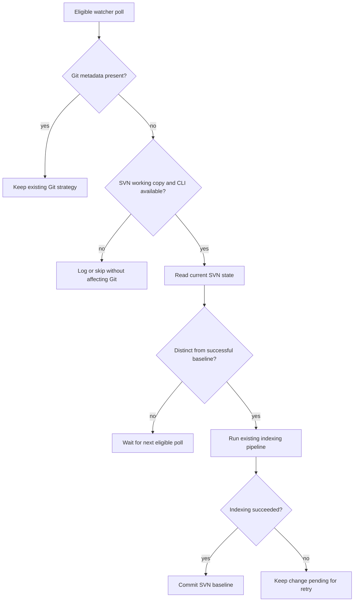
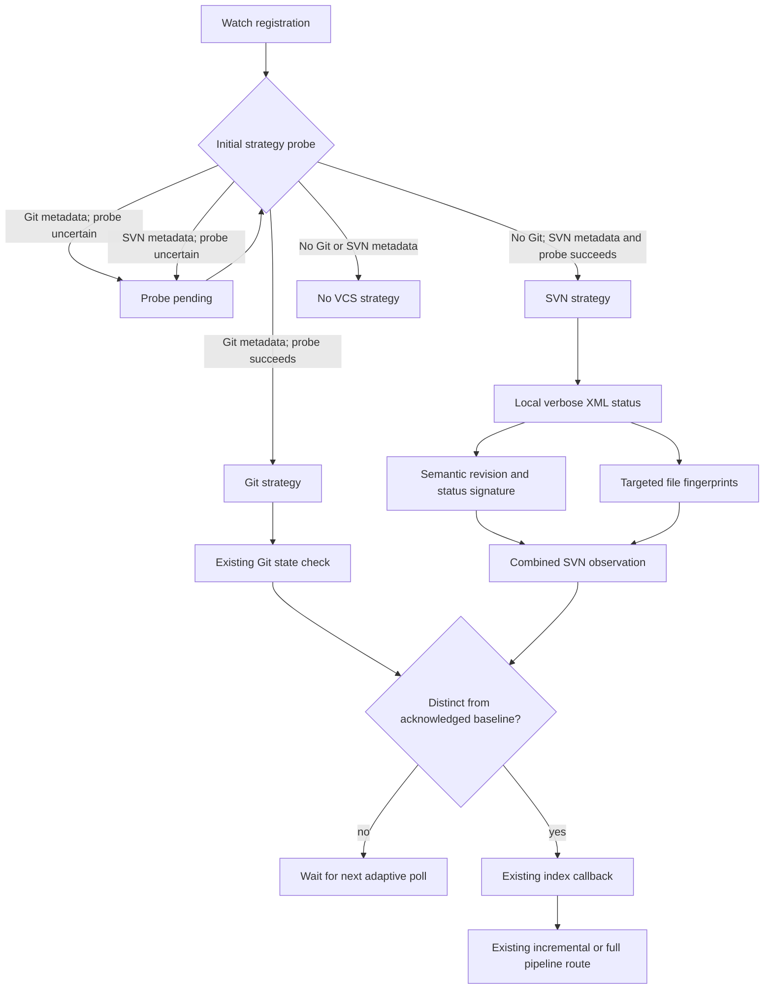
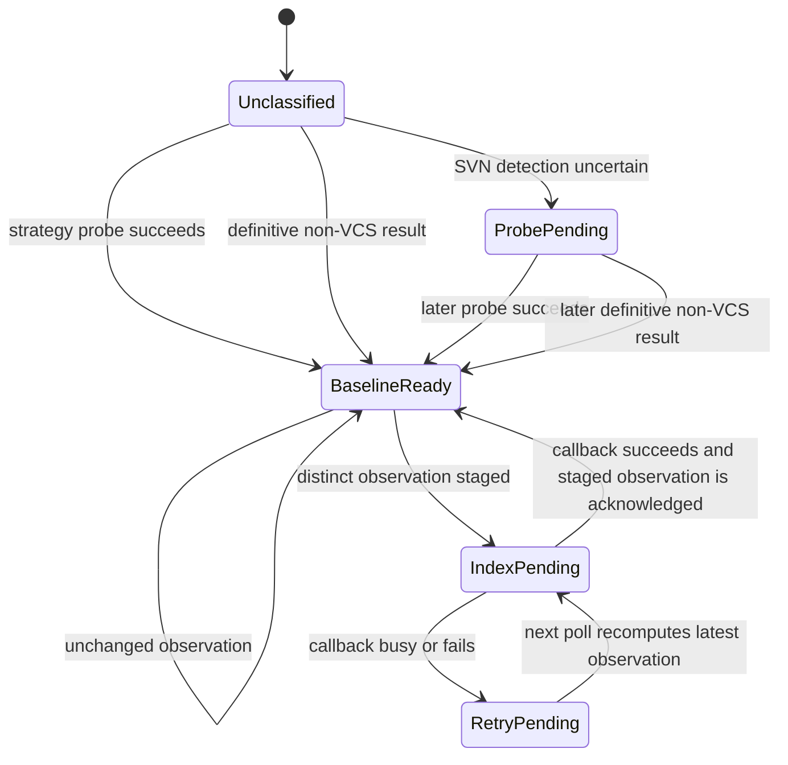

# SVN Auto-Watch Graph Sync - Plan

## Goal Capsule

- **Objective:** Keep an indexed graph synchronized with an SVN working copy without requiring a manual full regeneration after local edits, `svn update`, or `svn commit`.
- **Product authority:** This Product Contract defines SVN watcher behavior. Existing discovery rules and pipeline routing remain authoritative for file eligibility and incremental-versus-full indexing decisions.
- **Execution profile:** Deep cross-platform code change, implemented test-first in dependency order U1 through U4.
- **Stop conditions:** Stop if SVN polling cannot preserve the acknowledged-versus-pending baseline contract, if Git behavior regresses, or if upstream maintainers reject the design in the required tracking issue.
- **Tail ownership:** LFG owns implementation, review fixes, DCO-compliant English commits, the fork feature branch, the upstream PR, and CI stabilization. The fork's `main` synchronizes only after upstream merge.
- **Open blocker:** The upstream project requires a tracking issue and maintainer feedback before feature implementation begins. No product-scope question remains open.
- **Tracking issue:** `DeusData/codebase-memory-mcp#1113` requests the required design feedback before implementation.

---

## Product Contract

### Summary

Extend background auto-watch to pure SVN working copies. Any distinct change to indexable working-copy files triggers the existing graph update pipeline on the next eligible watcher poll so the graph follows the current on-disk development state.

### Problem Frame

SVN users currently receive no background change detection because the watcher only recognizes Git repositories. After every SVN update or commit, they must request a full graph regeneration to restore synchronization, even when only a small set of files changed.

### Actors

- A1. **SVN developer:** Edits, adds, removes, renames, resolves conflicts in, commits, or updates a local SVN working copy.
- A2. **Background watcher and indexing pipeline:** Detects a new working-copy state, schedules reindexing, and updates the graph through the existing routing rules.

### Key Decisions

- **The on-disk working copy is authoritative** (session-settled: user-directed — chosen over operation-boundary-only or tracked-file-only synchronization: the graph must follow local development state before and after SVN operations). This includes versioned and unversioned source files, deletions, renames, and conflicted contents that remain eligible under existing discovery rules.
- **Scope is limited to auto-watch graph synchronization** (session-settled: user-directed — chosen over broader SVN feature parity: automatic graph freshness solves the observed manual-regeneration cost without adding unrelated history or analysis work).
- **Existing timing and pipeline routing remain authoritative** (session-settled: user-directed — chosen over a fixed five-second target or forced incremental routing: SVN should inherit the watcher's adaptive poll timing and the pipeline's safety fallback to full indexing).
- **SVN-aware polling is the change-detection mechanism** (session-settled: user-directed — chosen over filesystem snapshots or dual-signal detection: it extends the current VCS-aware watcher with the smallest ongoing maintenance surface).
- **The system SVN CLI is a runtime prerequisite on all supported platforms** (session-settled: user-directed — chosen over a bundled client or CLI-free implementation: this matches the current external VCS command pattern and preserves cross-platform scope).
- **Git takes precedence in mixed roots** (session-settled: user-directed — chosen over SVN precedence or simultaneous dual watching: one watcher strategy per project avoids duplicate reindex events).
- **Contribution work uses a fork feature branch** (session-settled: user-directed — chosen over pushing unreviewed feature commits to the fork's `main`: the fork main branch should synchronize with upstream only after the upstream PR merges).

### Requirements

**Registration and state detection**

- R1. With `auto_watch` enabled, an indexed pure SVN working copy with a callable system `svn` command must register for background change detection.
- R2. A project root containing both `.git` and `.svn` must retain the existing Git watcher strategy and must not run a second SVN strategy.
- R3. SVN state detection must maintain a working-copy baseline that represents repository revision state and local working-copy changes without repeatedly triggering on an unchanged state.
- R4. The SVN state must distinguish distinct changes involving versioned files, unversioned source files, deletions, renames, and conflict states.

**Graph synchronization**

- R5. A distinct SVN working-copy state must trigger the existing indexing pipeline on the next eligible adaptive watcher poll.
- R6. After a successful update, the graph must reflect the current set and contents of on-disk files allowed by existing discovery rules.
- R7. Changes confined to `.svn` metadata or other non-indexable files must not add those files to the graph.
- R8. The existing pipeline must retain authority to choose incremental indexing for ordinary changes and full indexing when its current safety threshold requires it.
- R9. Local edits and the file effects of `svn update` or `svn commit` must require no manual graph regeneration.

**Reliability and compatibility**

- R10. A busy, skipped, or failed indexing callback must leave the detected SVN state pending so a later watcher poll retries it.
- R11. A missing or failing `svn` command must produce a diagnosable log, preserve retryable state, and leave Git-watched projects operational.
- R12. SVN auto-watch must behave consistently on macOS, Linux, and Windows when a compatible system `svn` command is available.
- R13. Common, mixed-revision, and sparse SVN working copies must be covered by compatibility tests for state detection.
- R14. Disabling `auto_watch` must prevent SVN watcher registration through the same existing gate used for Git projects.
- R15. The first release must not add an SVN-specific timing setting, VCS selector, status interface, bundled client, or new indexing route.

### Key Flow

- F1. SVN working-copy synchronization
  - **Trigger:** A registered SVN working copy reaches its next eligible adaptive watcher poll.
  - **Actors:** A1, A2.
  - **Steps:** Detect the applicable VCS strategy, compare the current SVN state with the last successful baseline, invoke the existing pipeline for a distinct change, and commit the new baseline only after successful indexing.
  - **Outcome:** The graph follows the current indexable working-copy files; failed or busy updates remain pending for retry.
  - **Covered by:** R1-R14.

### Acceptance Examples

- AE1. **Covers R4-R6, R9.** Given a clean SVN working copy, when a developer modifies a tracked source file or creates an unversioned source file, then one later eligible poll updates the graph without a manual full regeneration.
- AE2. **Covers R4-R7.** Given an indexed SVN working copy, when a source file is deleted, renamed, or contains conflict markers, then the next successful graph update reflects the current on-disk state while `.svn` metadata remains excluded.
- AE3. **Covers R3-R6, R9.** Given a clean working copy, when `svn update` changes, adds, or removes source files, then the changed SVN state triggers the existing pipeline even though the resulting working copy is clean.
- AE4. **Covers R5, R8-R9.** Given a developer whose local edits were already synchronized, when `svn commit` changes SVN state without further source content changes, then the watcher may route through a pipeline no-op and the graph remains correct without manual regeneration.
- AE5. **Covers R8.** Given an SVN update large enough to cross the existing pipeline safety threshold, when synchronization runs, then the pipeline may select full indexing without introducing an SVN-specific threshold.
- AE6. **Covers R10-R11.** Given a detected SVN change, when the pipeline is busy or `svn` temporarily fails, then the baseline is not committed and a later poll retries after logging the failure.
- AE7. **Covers R2, R12-R14.** Given a supported platform, when a root contains both Git and SVN metadata or `auto_watch` is disabled, then existing Git precedence and registration controls remain unchanged.

### Success Criteria

- SVN users no longer need to request full graph regeneration after ordinary working-copy edits, updates, or commits.
- A stable SVN state triggers no repeated indexing, while each distinct state is eligible for one successful synchronization.
- Git watcher regression coverage remains green and new SVN watcher behavior is covered across supported operating-system command conventions.
- User-facing documentation no longer describes auto-watch as Git-only and states the system `svn` prerequisite and failure behavior.

### Scope Boundaries

**In scope**

- Pure SVN working-copy recognition, baselining, polling, retry behavior, and graph-update triggering.
- Existing `auto_watch`, discovery, pipeline routing, and logging conventions.
- Cross-platform behavior using the system SVN CLI.

**Out of scope**

- SVN history, author, revision metadata in the graph, impact analysis, or SVN support in other Git-coupled MCP capabilities.
- A generic filesystem watcher, filesystem snapshot polling, or simultaneous Git and SVN event merging.
- New VCS configuration, watcher status surfaces, fixed synchronization timing, bundled SVN binaries, or changed discovery eligibility.

### Dependencies and Assumptions

- A compatible `svn` executable is installed and available to the server process.
- Existing discovery and pipeline contracts remain unchanged; this feature supplies an additional watcher trigger, not a new indexing algorithm.
- Implementation begins only after an upstream tracking issue receives maintainer feedback, as required by `CONTRIBUTING.md`.
- Every commit carries a matching DCO `Signed-off-by` trailer, and commit messages plus PR title and body are written in English.
- The upstream PR is opened from a fork feature branch. After upstream merge, the fork's `main` is synchronized to `upstream/main`.

### Sources and Research

- `src/watcher/watcher.c` and `src/watcher/watcher.h`: current Git-only strategy, adaptive polling, baselines, and retry contract.
- `src/main.c`: watcher callback integration with the existing indexing pipeline.
- `src/pipeline/pipeline.c` and `src/pipeline/pipeline_incremental.c`: incremental routing and full-index safety fallback.
- `src/mcp/mcp.c` and `README.md`: `auto_watch` registration behavior and current product wording.
- `src/discover/discover.c`: VCS metadata exclusions.
- `tests/test_watcher.c` and `tests/test_mcp.c`: watcher state, retry, registration, and regression patterns.
- `CONTRIBUTING.md`, `DCO`, and `.github/pull_request_template.md`: issue-first contribution policy, PR scope, testing, and sign-off requirements.

---

## Planning Contract

**Product Contract preservation:** Product Contract unchanged.

### Key Technical Decisions

- KTD1. **Use one positively identified VCS strategy per watch registration** (session-settled: user-directed — chosen over SVN precedence or simultaneous dual watching: Git-first classification prevents duplicate graph updates). A successful Git or SVN classification remains fixed until unwatch/rewatch or restart, while uncertain SVN detection stays unclassified and retryable; only a definitive non-working-copy result settles to `none`. Root Git metadata is authoritative for precedence: a failed Git probe cannot fall through to SVN. Without Git metadata, root `.svn` metadata identifies an SVN candidate whose CLI/XML failure remains retryable; a root with neither metadata type settles to `none` without invoking SVN.
- KTD2. **Represent SVN state with recursive semantic and content signatures** (session-settled: user-directed — chosen over filesystem snapshots or dual-signal watching: SVN-aware polling is the smallest extension of the proven VCS watcher). A local-only, machine-readable verbose status supplies per-entry revisions and states; targeted content-sensitive fingerprints distinguish repeated edits whose SVN state label remains unchanged. A schema-scoped incremental parser accepts only the required Subversion status structure, predefined/numeric entities, and bounded tokens; it rejects DTD/external-entity constructs and incomplete structure while safely ignoring unknown schema extensions. The parser streams entries in `O(N + K + B)` work, where `N` is status entries, `K` is unique candidate files, and `B` is bytes fingerprinted under the existing per-file indexing limit.
- KTD3. **Advance only the pre-callback observation after confirmed successful indexing.** Keep acknowledged and pending SVN signatures separate, stage the current observation before the callback, and commit that exact observation only when the pipeline return code or supervised MCP response explicitly represents success. A non-null error envelope remains a callback failure, and a later edit made during indexing remains detectable on the next poll.
- KTD4. **Reuse adaptive polling and the existing pipeline callback** (session-settled: user-directed — chosen over a fixed five-second target or forced incremental routing: the current watcher and pipeline already own timing and safety fallback). SVN adds no routing threshold, indexing mode, or graph mutation path.
- KTD5. **Use the system SVN CLI without a new library dependency** (session-settled: user-directed — chosen over a bundled client or CLI-free implementation: the existing watcher already uses a validated cross-platform VCS command path). Resolve and pin an absolute executable once from trusted `PATH` entries that exclude the current/watched root, reject an executable beneath the project, then reuse the stream-oriented `cbm_popen` boundary as a scoped compromise. Reject truncated command construction, validate complete XML and process success, and treat overflow or parse failure as retryable uncertainty. Localized stderr is diagnostic only.
- KTD6. **Keep materialized SVN externals inside the disk-authoritative state without blocking the primary working copy.** Follow one local status traversal, namespace external entries by root-relative path, and fingerprint only status-selected external candidates. Primary and external observation completeness are tracked separately: a broken external retains its last acknowledged contribution and retries later while a complete primary observation may still synchronize. Every nested `.svn` administration directory remains excluded.
- KTD7. **Coordinate graph replacement with the existing MCP store cache on its owning thread.** The watcher feeds the same pipeline and project database used by current MCP queries, but a full rebuild may replace the database beneath a cached connection. After confirmed indexing success, the watcher thread publishes only a thread-safe stale-store notification; the single MCP event-loop thread consumes it before its next store resolution, closes the affected cached handle, and reopens the replacement. The background watcher never closes a store used by an in-flight query, and failed indexing publishes no invalidation.
- KTD8. **Ship from a fork feature branch** (session-settled: user-directed — chosen over pushing unreviewed work to the fork's `main`: the fork main branch remains a clean upstream synchronization point).
- KTD9. **Keep graph eligibility owned by discovery while allowing conservative watch triggers.** The SVN leaf may use stable public skip/language predicates and the existing per-file indexing byte limit when fingerprinting status-selected paths. It must not duplicate private ignore logic or run whole-root discovery on every poll; a bounded extra pipeline no-op is preferable to a second eligibility implementation, while the pipeline remains the sole authority over graph contents.

### High-Level Technical Design

The watcher extends its current Git-specific state into a strategy-owned baseline while retaining the existing scheduler, root lifecycle, callback, and pipeline boundaries.

The baseline is an acknowledgement state machine, not a last-observed cache.

### Assumptions and Implementation Constraints

- SVN polling uses a recursive verbose XML status with ignored items visible and no remote out-of-date lookup, so normal polls remain local and non-interactive.
- The SVN observation module uses a schema-scoped incremental parser, streams decoded semantic fields, rejects DTD/external-entity constructs and incomplete output, and bounds individual tokens/paths. Order-independent fixed-size entry digests avoid retaining or sorting the full XML document, and localized stderr never controls state.
- Every XML-derived path must be relative, normalized, and contained beneath the watched root. Fingerprinting and descendant walks skip symlinks, junctions/reparse points, non-regular files, `.svn`, and paths that are absolute, drive-qualified, parent-traversing, or outside the canonical root.
- Status-driven content fingerprints cover modified, added, replaced, conflicted, obstructed, unversioned, and ignored candidates that pass stable public discovery predicates and the existing per-file indexing byte limit. Topmost unversioned or ignored directories are coalesced before a bounded descendant walk so each candidate is visited once; private ignore logic is not duplicated and pipeline discovery remains the sole authority over what enters the graph.
- A dirty working copy present at registration follows existing Git semantics: the initial poll establishes revision state but leaves the nonzero dirty signature unacknowledged, causing one synchronization on the next eligible poll.
- Probe failure and index failure are distinct. Probe failure never invokes indexing or overwrites an acknowledged baseline; callback failure stages no acknowledgement.
- SVN scheduling starts the next adaptive interval after probe/callback completion, preventing a slow recursive poll from becoming immediately due again; the interval formula remains unchanged.
- `auto_watch=false` remains a registration-time gate, and VCS metadata changes do not hot-switch an existing watch entry.
- SVN 1.14.x is the primary compatibility reference. CI-installed client versions may vary only where the required XML/status options and semantics remain compatible.
- No applicable institutional learning documents exist under `docs/solutions/`; current source, tests, and official Subversion documentation are authoritative.

### System-Wide Impact

- **Watcher state:** `src/watcher/watcher.c` gains metadata-first strategy selection and SVN acknowledgement fields while a private `src/watcher/svn_state.c` leaf owns trusted CLI resolution and XML observation construction. Scheduling, missing-root pruning, deferred free, and callback concurrency stay in the watcher.
- **Pipeline and graph:** No pipeline implementation changes are planned. The existing callback and stored file hashes remain the sole graph synchronization route.
- **MCP context parity:** A successful SVN-triggered update must become visible through existing graph query tools in the same running server session, including after a full route replaces the database file.
- **Performance:** Recursive verbose status and targeted candidate hashing must remain one status process, one streaming entry pass, one visit per unique candidate, and no read beyond the existing per-file indexing limit. Characterization reports total bytes hashed as well as entries and candidates. Adaptive polling and completion-relative scheduling remain the load controls; no aggregate byte cap or wall-clock SLA is added because either would make distinct eligible changes unobservable.
- **Security and portability:** Machine-readable output avoids localization drift. Existing shell-argument validation, Windows command isolation, XML entity decoding, separators, spaces, Unicode, and peg-revision-sensitive paths require explicit coverage.
- **CI and contributor workflow:** Native SVN fixtures require `svn` and `svnadmin` on Unix and MSYS2 test jobs. The feature remains one issue and one focused PR.

### Risks and Mitigations

| Risk | Mitigation |
|---|---|
| A root-only revision or `svnversion` aggregate misses interior mixed-revision changes | Hash per-entry working revisions from recursive verbose status. |
| XML state remains unchanged across repeated edits or Windows mtime resolution collides | Content-hash status-selected files and eligible descendants of coalesced unversioned directories; stat metadata may only be a fast-path input. |
| Malformed, truncated, locked, or unavailable CLI output is mistaken for a clean tree | Require successful process completion plus a complete XML document and preserve the acknowledged baseline on any uncertainty. |
| A concurrent edit lands while indexing | Acknowledge the staged pre-callback observation, never a post-index reread. |
| Externals or large working copies make polling expensive | Keep status local-only, retain adaptive intervals, avoid whole-tree fingerprints except status-selected unversioned/ignored directories, cap each file at the existing indexing read limit, and characterize entries plus bytes hashed. |
| Windows paths or XML escaping destabilize signatures | Decode XML entities, normalize separators for internal lookup, and test spaces, Unicode, `@`, leading dashes, CRLF, and long paths. |
| A decoded status path or unversioned link escapes the project | Reject unsafe path forms, require canonical root containment, and never follow symlinks, junctions/reparse points, or non-regular files. |
| A repository-local executable shadows the system SVN client | Resolve from trusted non-project `PATH` entries, pin the canonical absolute executable, and test hostile current-directory shadowing. |
| A full pipeline route replaces the database under a cached MCP store | Publish a post-success stale notification and let the MCP event-loop thread close/reopen before its next query; verify overlapping queries and replacement on every CI platform. |
| A supervised worker returns an MCP error envelope | Parse the response outcome; report callback failure, retain the pending observation, and skip store invalidation. |
| A recursive SVN command hangs indefinitely at the existing stream boundary | Prevent overlapping polls and schedule from completion; true process timeout/supervision remains a documented residual risk outside this focused PR. |
| New code changes existing Git behavior | Keep strategy-specific probes behind Git-first classification and run the full existing watcher suite unchanged. |

### Alternatives Considered

- **Root revision or `svnversion` only:** Rejected because commits and updates can change interior node revisions without changing a useful root or aggregate signal.
- **Hash raw XML output:** Rejected because formatting and path representation are not the semantic contract, and raw status still cannot detect repeated content edits.
- **Generic filesystem snapshot watcher:** Rejected by the settled scope because it scans beyond SVN state and introduces a broader non-VCS feature.
- **SVN plus filesystem dual watcher:** Rejected by the settled scope because duplicate event ownership and baseline reconciliation exceed the functional core.
- **New cross-platform subprocess capture layer:** Deferred because the established watcher command path already provides PATH lookup, streamed output, and Windows isolation; expanding the process API would broaden the PR without changing product behavior or solving the entire timeout contract.
- **Ignore externals:** Rejected because existing discovery may index their on-disk source, so ignoring their changes would violate the disk-authoritative graph requirement.

### Sources and Research

- `src/watcher/watcher.c`, `src/watcher/watcher.h`, and `tests/test_watcher.c`: acknowledged-versus-pending signatures, dirty-at-baseline behavior, adaptive scheduling, callback retries, and Git regression patterns.
- `src/foundation/compat_fs.c` and `src/foundation/subprocess.c`: current streamed command behavior, Windows handle isolation, and the limits of the non-capturing subprocess API.
- `src/mcp/mcp.c`, `src/mcp/mcp.h`, and `src/main.c`: live store ownership and watcher callback integration that shape same-session graph visibility.
- Apache Subversion 1.14 release notes: `https://subversion.apache.org/docs/release-notes/1.14.html`.
- Official `svn status` reference and 1.14 XML schema: `https://svnbook.red-bean.com/en/1.8/svn.ref.svn.c.status.html` and `https://github.com/apache/subversion/blob/1.14.x/subversion/svn/schema/status.rnc`.
- Official mixed-revision, sparse working-copy, externals, and peg-revision behavior: `https://svnbook.red-bean.com/en/1.8/svn.basic.in-action.html#svn.basic.in-action.mixedrevs`, `https://svnbook.red-bean.com/en/1.8/svn.advanced.sparsedirs.html`, `https://svnbook.red-bean.com/en/1.8/svn.advanced.externals.html`, and `https://svnbook.red-bean.com/en/1.8/svn.advanced.pegrevs.html`.

### Sequencing

U1 establishes the observable SVN state contract before U2 connects it to watcher acknowledgement and retry behavior. U3 proves graph and platform integration after both state layers exist. U4 updates the user contract only after behavior and prerequisites are verified.

---

## Implementation Units

### U1. Add secure SVN observation and semantic state probes

- **Goal:** Provide a private, stable, local-only SVN observation leaf that detects clean revision movement and repeated content edits without coupling XML or CLI concerns to watcher scheduling.
- **Requirements:** R1, R3-R4, R7, R11-R13, R15; KTD2, KTD5-KTD6, KTD9.
- **Dependencies:** None.
- **Files:** `src/watcher/svn_state.c`, `src/watcher/svn_state.h`, `tests/test_svn_state.c`, `tests/test_main.c`, `Makefile.cbm`, `.github/workflows/_test.yml`.
- **Approach:** Add an internal tri-state SVN probe that resolves a trusted absolute CLI path, streams recursive verbose XML status through a schema-scoped parser, emits semantic/content signatures plus entry count, and owns XML entity/path normalization. Hash decoded per-entry revision/state fields into order-independent fixed-size digests; content-hash unique, contained, regular status-selected candidates only up to the existing indexing byte limit; coalesce overlapping unversioned/ignored directory walks without duplicating private discovery rules; and treat process, truncation, overflow, unsafe paths, or XML failure as uncertainty. Register the `svn_state` suite in the existing test runner and install `svn`/`svnadmin` only in CI jobs that execute native C suites.
- **Execution note:** Start with the standalone parser/probe suite and real `svnadmin` fixtures before integrating any watcher lifecycle state.
- **Patterns to follow:** Streaming Git signatures in `src/watcher/watcher.c`; isolated Windows `cbm_popen` behavior in `src/foundation/compat_fs.c`; temporary repository helpers in `tests/test_watcher.c`; `.svn` exclusion in `src/discover/discover.c`.
- **Test scenarios:**
  - Parser fixtures cover normal, added, deleted, missing, replaced, moved, obstructed, ignored, unversioned, property, text/property/tree conflict, switched, copied, sparse, and external fields.
  - Complete XML split across small input chunks produces the same observation as a single stream; truncated or malformed XML remains uncertain and retains no partial observation.
  - The parser accepts predefined/numeric entities, ignores unknown schema extensions, and rejects DTD, external-entity, oversized-token, and structurally incomplete input.
  - Reordered equivalent entries produce the same signature without retaining the full document; counters prove one entry finalization and at most one content fingerprint per unique candidate.
  - A real clean update that modifies, adds, or deletes a child changes per-entry revision state even when the resulting working copy is clean.
  - A real child commit changes mixed-revision state without relying on the root or aggregate revision.
  - A tracked same-size rapid rewrite and restored-timestamp rewrite change the content signature while the path remains modified.
  - A file inside an already unversioned or ignored directory changes the signature again; overlapping directory candidates visit each descendant once and never enter `.svn`.
  - Materialized file/directory externals share the one local status traversal and are namespaced by root-relative path; a broken external retains its prior contribution without blocking a complete primary observation.
  - Missing CLI, non-working-copy roots, nonzero exit, command-buffer truncation, overflow, malformed XML, and incomplete output are distinguished.
  - A repository-local `svn`/`svn.exe`, hostile current directory, empty `PATH` component, or executable beneath the watched root cannot shadow the pinned system client.
  - Spaces, Unicode, XML-special characters, `@`, leading dashes, long paths, Windows separators, and CRLF decode into stable file lookups.
  - Absolute, drive-qualified, parent-traversing, symlink, junction/reparse-point, special-file, and external-escape candidates are rejected without file reads.
  - Unsupported or oversized files do not enter the content-hash workload; synthetic 1K, 10K, and 50K entry streams keep parser buffering bounded and report non-gating time, RSS, and total bytes hashed.
- **Verification:** The focused SVN state suite proves a single pinned local process, streaming semantic correctness, bounded parser memory, `O(N + K + B)` traversal, path containment, and required real working-copy semantics without repository-network access.

### U2. Integrate SVN observations with watcher baselines and retries

- **Goal:** Apply SVN observations to the existing adaptive poll lifecycle without losing changes, repeatedly indexing stable states, or changing Git behavior.
- **Requirements:** R1, R3-R5, R9-R12, R14-R15; F1; AE1-AE4, AE6-AE7; KTD1-KTD5.
- **Dependencies:** U1.
- **Files:** `src/watcher/watcher.c`, `src/watcher/watcher.h`, `tests/test_watcher.c`.
- **Approach:** Replace the Git boolean with `none`, `git`, and `svn` strategies while keeping the SVN leaf behind a private boundary. Classify from root metadata before probing: Git metadata blocks SVN fallback even when Git probing is uncertain; `.svn` without Git remains retryable until the SVN probe confirms it; neither metadata type settles to `none`. Store acknowledged and pending SVN semantic/content signatures, establish revision state while leaving pre-existing dirt eligible for one sync, stage observations before the callback, acknowledge only on confirmed success, and recompute after failure. Reuse file-count-derived adaptive intervals, but schedule the next SVN eligibility window after the current probe/callback completes.
- **Execution note:** Add characterization coverage around existing Git baseline/retry behavior before generalizing shared lifecycle code.
- **Patterns to follow:** Pending Git HEAD/dirty signature acknowledgement in `src/watcher/watcher.c`; callback return contract in `src/watcher/watcher.h`; `auto_watch` registration coverage in `tests/test_mcp.c`.
- **Test scenarios:**
  - A pre-existing dirty SVN working copy initializes without an immediate callback and triggers exactly once on the next eligible poll.
  - An unchanged clean or dirty SVN state does not retrigger, while each later distinct edit triggers once.
  - Callback success acknowledges the staged pre-callback state; an edit made during the callback remains visible on the next poll.
  - Busy and failed callbacks preserve acknowledged state, recompute the latest observation on retry, and acknowledge only a later success.
  - CLI or XML probe failure neither invokes the callback nor advances state; recovery coalesces intermediate changes into one latest-state sync.
  - A temporarily unavailable SVN CLI at initial baseline remains retryable and later classifies as SVN; a definitive non-working-copy result settles to `none`.
  - A mixed root whose Git probe temporarily fails remains pending as Git-first and never falls through to SVN; an ordinary root with neither `.git` nor `.svn` settles to `none` without an SVN command.
  - File-count changes refresh the existing adaptive interval without adding an SVN-specific timer.
  - A slow SVN probe receives one full adaptive interval after completion before it becomes eligible again and never overlaps itself.
  - `auto_watch=false`, project deletion, explicit unwatch, missing-root grace pruning, uncertain root errors, and watcher shutdown retain existing behavior for SVN entries.
  - Existing Git tests remain unchanged and green, including dirty-state deduplication and failed callback retry.
- **Verification:** The focused watcher suite proves one callback per distinct acknowledged state, retry safety, completion-relative SVN scheduling, watcher lifecycle behavior, and unchanged Git semantics. Existing MCP `auto_watch` tests remain green in the full suite as R14 registration evidence.

### U3. Coordinate live MCP stores and prove graph synchronization

- **Goal:** Make incremental and full SVN-triggered updates visible through the same running MCP server without stale cached stores.
- **Requirements:** R5-R13; F1; AE1-AE6; KTD3-KTD7.
- **Dependencies:** U1, U2.
- **Files:** `src/main.c`, `src/mcp/mcp.c`, `src/mcp/mcp.h`, `tests/test_integration.c`.
- **Approach:** Normalize supervised responses into the watcher callback contract so only an explicit non-error index result returns success. After that success, publish a thread-safe stale-store notification through callback `user_data` or a narrow public MCP interface; consume it on the MCP event-loop thread before the next store resolution, where the affected cached handle is closed and reopened. The watcher thread never closes the store directly. Use one real SVN integration sequence to pre-warm a query store, apply working-copy changes, run the real watcher/pipeline path, and query again through the same server instance; exercise full replacement through existing pipeline test setup rather than an SVN-specific routing threshold.
- **Patterns to follow:** MCP store resolution/cache ownership in `src/mcp/mcp.c`; watcher callback integration in `src/main.c`; pipeline-to-store-to-MCP flows in `tests/test_integration.c`.
- **Test scenarios:**
  - Covers AE1. A tracked edit and an unversioned source addition become queryable after one successful watcher update in the same server lifecycle.
  - Covers AE2. A deletion or rename removes stale graph state, and conflicted on-disk contents remain the pipeline input.
  - Covers AE3. A clean update changing, adding, and deleting files refreshes graph results without another explicit `index_repository` call.
  - Covers AE4. A commit after already-synchronized content may route through an incremental no-op while graph results remain correct.
  - Covers AE5. An existing full-route fixture replaces the database, invalidates/reopens the pre-warmed store, and keeps graph queries correct through the same server instance.
  - Covers AE6. A busy or failed callback leaves the prior graph queryable; a later successful retry exposes the latest state.
  - MCP store coordination occurs only after successful indexing and does not invalidate a queryable prior graph on probe/callback failure.
  - A non-null supervised `isError` response returns callback failure, preserves the pending observation, and publishes no stale-store notification.
  - A query overlapping watcher indexing continues on its owned handle; the next event-loop query consumes the stale notification and reopens safely, with TSan coverage for the notification handoff.
- **Verification:** The focused integration suite proves same-session query visibility across incremental, no-op, retry, and database-replacing full routes. The full CI matrix proves the real SVN fixture has no platform skip path.

### U4. Document SVN auto-watch and contribution constraints

- **Goal:** Make the expanded auto-watch behavior, prerequisite, failure posture, and unchanged controls discoverable to users and contributors.
- **Requirements:** R1, R11-R15; KTD5-KTD8.
- **Dependencies:** U1-U3.
- **Files:** `README.md`, `CONTRIBUTING.md`.
- **Approach:** Replace Git-only watcher wording with Git-and-SVN behavior, document the system `svn` prerequisite and local-only polling, retain `auto_watch` as the only control, and keep implementation notes aligned with the approved tracking issue and DCO process. Update `CONTRIBUTING.md` only if its architecture map would otherwise remain factually Git-only.
- **Test scenarios:** Test expectation: none -- this unit changes documentation after U1-U3 provide executable evidence.
- **Verification:** Documentation matches the shipped behavior, names no unsupported SVN history capability, and introduces no new user control.

---

## Verification Contract

| Gate | Command | Proves |
|---|---|---|
| Focused SVN observation | `make -f Makefile.cbm test-focused TEST_SUITES=svn_state` | Streaming XML semantics, real working-copy state, content fingerprints, failure classification, and bounded traversal. |
| Focused watcher lifecycle | `make -f Makefile.cbm test-focused TEST_SUITES=watcher` | Strategy selection, acknowledgement, retry, scheduling, lifecycle, and Git regression behavior. |
| Focused graph integration | `make -f Makefile.cbm test-focused TEST_SUITES=integration` | Same-session MCP visibility across incremental, no-op, failure/retry, and full database replacement. |
| Full sanitized suite | `scripts/test.sh` | Repository-wide C behavior under the project's authoritative sanitizer and production builds. |
| Static and formatting checks | `scripts/lint.sh` | clang-tidy, cppcheck, clang-format, and no-skip policy. |
| Patch hygiene | `git diff --check` | Whitespace and patch integrity. |
| CI matrix | GitHub PR checks | Native Linux, macOS, Windows/MSYS2, and TSan test jobs use real SVN tooling; CodeQL, security, DCO, and license checks remain required without an SVN-tooling claim. |

No browser test is required because this change has no UI or browser-facing behavior.

---

## Definition of Done

- Product Contract remains unchanged and every implementation decision traces to R/F/AE and KTD identifiers.
- U1 isolates and proves trusted machine-readable SVN state detection with streaming, bounded memory, content-sensitive bounded fingerprints, common/mixed/sparse/external semantics, path containment, and path-encoding cases.
- U2 proves acknowledged/pending baseline safety, one sync per distinct state, retry after probe/index failure, adaptive polling, lifecycle cleanup, and unchanged Git behavior.
- U3 proves only confirmed indexing success is acknowledged and the same running MCP server observes SVN-triggered incremental and database-replacing full updates without stale cached stores or cross-thread store closure on Linux, macOS, and Windows.
- U4 documents Git-and-SVN auto-watch, the system CLI prerequisite, retry behavior, unchanged `auto_watch` control, and excluded broader SVN capabilities.
- Focused tests, the full sanitized suite, lint, patch hygiene, and all required GitHub checks pass.
- The upstream tracking issue has maintainer approval, every commit includes a matching DCO sign-off, and the English PR references the issue.
- The final diff contains no abandoned parser, subprocess, filesystem-snapshot, or duplicate-watcher experiments and remains one focused feature PR.
- True recovery from a permanently hung `svn` process remains outside this PR; no claim or test may imply a timeout guarantee the existing process boundary does not provide.
