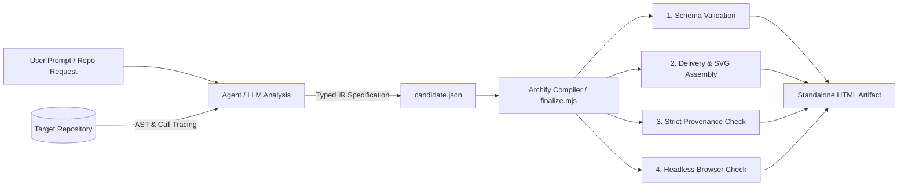
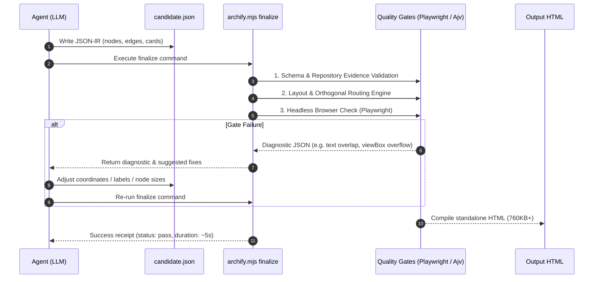

# Archify Diagram Generation: End-to-End Technical Process

This document provides a detailed, sequential breakdown of how **Archify** was installed, adapted, and executed to produce five verified, interactive architecture and behavioral diagrams for the **`codebase-memory-mcp`** codebase.

---

## Architecture of the Archify System

Archify operates on a compiler-pipeline model:


1. **The Skill Layer (`SKILL.md`)**: Instructs the LLM on JSON-IR schema rules, aesthetic guidelines, coordinate budgets, relationship classifications, and git citation requirements.
2. **The Verification Engine (`repository-evidence.mjs`)**: Inspects local git blobs and hashes to ensure every cited file, function, and line range exists in the repository.
3. **The Core Compiler (`archify.mjs` & `renderers/`)**: Compiles typed JSON into standalone HTML with embedded SVGs, responsive CSS, themes, and JetBrains Mono variable fonts.
4. **The Gate Supervisor (`finalize.mjs`)**: Orchestrates four strict verification gates (`validate`, `deliver`, `check`, `browser-check`) and performs real headless browser viewport rendering tests.

---

## Phase 1: Environment Discovery & Skill Installation

### 1.1 Tool Call: `list_dir`
* **Action**: Inspected `c:\AI\Source\storm` to locate available source repositories.
* **Findings**: Discovered `archify-main` (the Archify engine checkout) and `codebase-memory-mcp-main` (the target repository).

### 1.2 Tool Call: `view_file`
* **Action**: Read [`archify-main/README.md`](file:///c:/AI/Source/storm/archify-main/README.md), [`archify-main/AGENTS.md`](file:///c:/AI/Source/storm/archify-main/AGENTS.md), and [`archify/SKILL.md`](file:///c:/AI/Source/storm/archify-main/archify/SKILL.md).
* **LLM Reasoning**: Determined that Archify distributes as a global agent skill for AI agents (Antigravity, Cursor, Codex, Claude Code) and as a zero-runtime-dependency Node.js CLI tool (`bin/archify.mjs`).

### 1.3 Tool Call: `run_command` (Environment Verification)
* **Command**: `node -v; npm -v; npx skills --version`
* **Result**:
  * Node.js: `v24.18.0`
  * npm: `11.13.0`
  * Skills CLI: `v1.7.0`

### 1.4 Tool Call: `run_command` (Skill Discovery)
* **Command**: `npx -y skills add tt-a1i/archify --list --full-depth`
* **Result**: The Skills CLI detected the active `antigravity` environment and identified two installable skills: `archify` and `archify-review`.

### 1.5 Tool Call: `run_command` (Global Skill Installation)
* **Command**: `npx -y skills add tt-a1i/archify --skill archify --global --yes`
* **Result**: Installed `archify` into `~\.agents\skills\archify`.
* **Verification**: Ran `node bin/archify.mjs doctor`. All 19 self-test diagnostics reported `[ok]`.

---

## Phase 2: Target Repository Analysis & Git Engine Compatibility

### 2.1 Tool Call: `run_command` (Git Status Check)
* **Command**: `git rev-parse HEAD; git remote get-url origin` in `codebase-memory-mcp-main`
* **Problem Encountered**: `codebase-memory-mcp-main` was an extracted directory without a `.git` database. Furthermore, the local Git version was `2.5.1.windows.1` (which does not support `git remote get-url`, introduced in Git 2.7).
* **Remediation**:
  1. Extracted canonical repository URL from [`server.json`](file:///c:/AI/Source/storm/codebase-memory-mcp-main/server.json): `https://github.com/DeusData/codebase-memory-mcp`.
  2. Initialized repository snapshot:
     ```powershell
     git init
     git remote add origin https://github.com/DeusData/codebase-memory-mcp.git
     git add -A
     git commit -m "codebase-memory-mcp snapshot"
     ```
     Generated commit SHA: `b81ced4215f3dccee275ce67b3a6437c7fc6ed2e`.

### 2.2 Tool Call: `replace_file_content` (Git Backward-Compatibility Fix)
* **Target File**: [`archify/renderers/shared/repository-evidence.mjs`](file:///c:/AI/Source/storm/archify-main/archify/renderers/shared/repository-evidence.mjs#L218-L228)
* **Rationale**: Enabled fallback from `git remote get-url origin` to `git config --get remote.origin.url` so Archify runs seamlessly on Git < 2.7:
  ```javascript
  let origin;
  const originResult = runGit(realRoot, ['remote', 'get-url', 'origin']);
  if (originResult.status === 0) {
    origin = originResult.stdout.trim();
  } else {
    origin = gitValue(realRoot, ['config', '--get', 'remote.origin.url'], 'Evidence repository must have an origin remote.');
  }
  ```

---

## Phase 3: Codebase Exploration & Source Evidence Mapping

Archify strictly verifies citations against committed Git blobs. The LLM inspected key architectural modules:

| Subsystem | Inspected File | Verified Line | Architectural Responsibility |
|---|---|:---:|---|
| **Entry Point** | [`src/main.c`](file:///c:/AI/Source/storm/codebase-memory-mcp-main/src/main.c#L2748) | `2748` | `main()`: Process roles (`MAIN_LOCAL_CLI`, `DAEMON`, `WORKER`), allocator binding |
| **MCP Protocol** | [`src/mcp/mcp.c`](file:///c:/AI/Source/storm/codebase-memory-mcp-main/src/mcp/mcp.c#L17893) | `17893` | `tools/call` JSON-RPC dispatch for 17 tools |
| **Daemon IPC** | [`src/daemon/ipc.c`](file:///c:/AI/Source/storm/codebase-memory-mcp-main/src/daemon/ipc.c#L1) | `1` | Authenticated local socket transport, PID watchdog |
| **Pipeline** | [`src/pipeline/pipeline.c`](file:///c:/AI/Source/storm/codebase-memory-mcp-main/src/pipeline/pipeline.c#L2) | `2` | Multi-pass worker pool orchestration |
| **Tree-Sitter AST** | [`src/pipeline/pass_definitions.c`](file:///c:/AI/Source/storm/codebase-memory-mcp-main/src/pipeline/pass_definitions.c#L1) | `1` | Fused definition extraction across 162 languages |
| **Hybrid LSP** | [`src/pipeline/pass_lsp_cross.c`](file:///c:/AI/Source/storm/codebase-memory-mcp-main/src/pipeline/pass_lsp_cross.c#L1) | `1` | Cross-file semantic type and call resolution |
| **Cypher Engine** | [`src/cypher/cypher.c`](file:///c:/AI/Source/storm/codebase-memory-mcp-main/src/cypher/cypher.c#L2) | `2` | AST-to-SQL query planner and BFS traversal |
| **SQLite Store** | [`src/store/store.c`](file:///c:/AI/Source/storm/codebase-memory-mcp-main/src/store/store.c#L2) | `2` | In-memory SQLite with WAL mode and LZ4 compression |
| **Web Visualizer** | [`src/ui/http_server.c`](file:///c:/AI/Source/storm/codebase-memory-mcp-main/src/ui/http_server.c#L2) | `2` | Embedded HTTP server at `localhost:9749` |
| **Change Watcher** | [`src/watcher/watcher.c`](file:///c:/AI/Source/storm/codebase-memory-mcp-main/src/watcher/watcher.c#L2) | `2` | Git HEAD and dirty-state signature tracker |

### Tool Call: `run_command` (Blob Verification Script)
Executed a Node script verifying that all 10 files and lines exist as blobs in commit `b81ced4215f3dccee275ce67b3a6437c7fc6ed2e`. All 10 passed.

---

## Phase 4: Sequential Diagram Generation & Compiler Gates

Every diagram followed the iterative lifecycle:
1. Write JSON specification to `Diagrams/specs/<type>.json`
2. Run `archify finalize <type> <spec> <output.html> --quality showcase --json`
3. If diagnostics occurred, analyze the exact error code, adjust coordinates/labels, and re-run.



---

### Diagram 1: System Architecture (`architecture`)
* **Specification File**: [`Diagrams/specs/architecture.json`](file:///c:/AI/Source/storm/Diagrams/specs/architecture.json)
* **Output Artifact**: [`Diagrams/architecture.html`](file:///c:/AI/Source/storm/Diagrams/architecture.html)
* **Execution**:
  ```bash
  node archify-main/archify/bin/archify.mjs finalize architecture Diagrams/specs/architecture.json Diagrams/architecture.html --repo-root codebase-memory-mcp-main --quality showcase --json
  ```
* **Result**: `PASS` on initial attempt (Duration: 5,929 ms, Size: 769,751 bytes).

---

### Diagram 2: Multi-Pass Indexing Pipeline (`workflow`)
* **Specification File**: [`Diagrams/specs/workflow.json`](file:///c:/AI/Source/storm/Diagrams/specs/workflow.json)
* **Output Artifact**: [`Diagrams/workflow-indexing-pipeline.html`](file:///c:/AI/Source/storm/Diagrams/workflow-indexing-pipeline.html)
* **Initial Gate Failure**:
  * `composition/desktop-readability`: At 6 columns $\times$ 140px node width, total viewBox width reached 1,180px, dropping projected font size to 5.91px (below the 6.0px minimum floor).
* **LLM Auto-Correction**:
  1. Reduced `width` from 140px to 124px across all nodes.
  2. Shortened verbose sublabels (e.g., `"RAM-first fused graph staging"` $\to$ `"fused graph buffer"`).
* **Second Attempt**: `PASS` (Duration: 6,488 ms, Size: 763,325 bytes).

---

### Diagram 3: MCP Tool Call Request (`sequence`)
* **Specification File**: [`Diagrams/specs/sequence.json`](file:///c:/AI/Source/storm/Diagrams/specs/sequence.json)
* **Output Artifact**: [`Diagrams/sequence-tool-call.html`](file:///c:/AI/Source/storm/Diagrams/sequence-tool-call.html)
* **Initial Gate Failure**:
  * `layout/constraint`: Final message ended at $y = 470$, which did not leave the required 98px clearance for the legend above the bottom border within a 560px viewBox.
* **LLM Auto-Correction**:
  * Increased `meta.viewBox[1]` from 560 to 600.
* **Second Attempt**: `PASS` (Duration: 5,622 ms, Size: 758,479 bytes).

---

### Diagram 4: Knowledge Graph Data Flow (`dataflow`)
* **Specification File**: [`Diagrams/specs/dataflow.json`](file:///c:/AI/Source/storm/Diagrams/specs/dataflow.json)
* **Output Artifact**: [`Diagrams/dataflow-code-to-graph.html`](file:///c:/AI/Source/storm/Diagrams/dataflow-code-to-graph.html)
* **Initial Gate Failure**:
  * `composition/label-route-clearance`: Outgoing flows from `src_files` and `sqlite_db` had adjacent labels causing collision.
  * `composition/micro-segment`: Uneven node heights due to badge tags created 7px diagonal micro-segments.
* **LLM Auto-Correction**:
  1. Restructured Stage 3 into three parallel storage tiers (`mem_cache`, `sqlite_db`, `layout_store`) matching consumer rows.
  2. Standardized node heights by removing badge tags.
  3. Added vertical offsets (`labelDy: -18` and `labelDy: 24`) to separate adjacent labels.
* **Re-run Attempt**: `PASS` (Duration: 5,831 ms, Size: 768,602 bytes).

---

### Diagram 5: Indexing & Daemon Lifecycle (`lifecycle`)
* **Specification File**: [`Diagrams/specs/lifecycle.json`](file:///c:/AI/Source/storm/Diagrams/specs/lifecycle.json)
* **Output Artifact**: [`Diagrams/lifecycle-indexing-state.html`](file:///c:/AI/Source/storm/Diagrams/lifecycle-indexing-state.html)
* **Execution**: Modeled state transitions across 4 lanes: `main`, `waiting`, `recovery`, and `terminal`.
* **Result**: `PASS` on initial attempt (Duration: 7,105 ms, Size: 770,533 bytes).

---

## Phase 5: Portal Assembly

### Tool Call: `write_to_file`
* **Target**: [`Diagrams/index.html`](file:///c:/AI/Source/storm/Diagrams/index.html)
* **Action**: Created a central dashboard featuring:
  * Glassmorphism cards with gradient hover accents for each diagram.
  * Direct links to standalone interactive viewers and source JSON specifications.
  * Code citations and diagnostic pass badges.
  * Metric summary cards (5/5 diagram types, 100% gates passed, 162 languages, <1ms latency).

---

## Summary of Tools & Scripts Used

| Tool / Script | Invocation Source | Purpose |
|---|---|---|
| `list_dir` | Agent Native Tool | Discovered directories in `c:\AI\Source\storm` |
| `view_file` | Agent Native Tool | Read Archify documentation, schemas, and C source code |
| `run_command` | Agent Native Tool (pwsh) | Ran `git`, Node.js scripts, and CLI compilations |
| `write_to_file` | Agent Native Tool | Authored JSON-IR specs and `Diagrams/index.html` |
| `replace_file_content` | Agent Native Tool | Patched Git 2.5 compatibility in Archify verification engine |
| `skills` CLI | npm (`npx skills`) | Installed global Archify skill to `~\.agents\skills\archify` |
| `bin/archify.mjs` | Archify Node Runtime | CLI entry point for `doctor` and `finalize` |
| `bin/finalize.mjs` | Archify Compiler | Orchestrated 4 quality gates and browser test validation |
| `repository-evidence.mjs` | Archify Internal | Verified file paths and line numbers against Git commit hashes |
| `layout3d.c` | codebase-memory-mcp | Analyzed to explain the separation between 3D layout and WAL tables |
