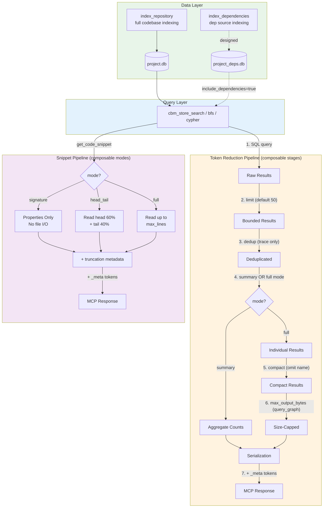

# Feature Matrix: Existing + New Features

## Branch Availability

| Feature | `main` (upstream) | `reduce-token-usage` | `reference-api-indexing` | `merged` |
|---------|:-:|:-:|:-:|:-:|
| **Existing Features** | | | | |
| index_repository (full/fast modes) | Y | Y | Y | Y |
| search_graph (label, name_pattern, qn_pattern, file_pattern, degree filters) | Y | Y | Y | Y |
| query_graph (Cypher subset, max_rows) | Y | Y | Y | Y |
| trace_call_path (direction, depth, edge_types, risk_labels) | Y | Y | Y | Y |
| get_code_snippet (qualified_name, auto_resolve, include_neighbors) | Y | Y | Y | Y |
| search_code (pattern, regex, file_pattern) | Y | Y | Y | Y |
| detect_changes (scope, base_branch, depth) | Y | Y | Y | Y |
| get_architecture (aspects) | Y | Y | Y | Y |
| get_graph_schema | Y | Y | Y | Y |
| manage_adr (get/update/sections) | Y | Y | Y | Y |
| ingest_traces | Y | Y | Y | Y |
| list_projects / delete_project / index_status | Y | Y | Y | Y |
| Auto-sync (background watcher) | Y | Y | Y | Y |
| CLI mode | Y | Y | Y | Y |
| **Token Reduction (New)** | | | | |
| search_graph: `mode=summary` | - | Y | - | Y |
| search_graph: `compact=true` | - | Y | - | Y |
| search_graph: `limit` default 50 (was 500K) | - | Y | - | Y |
| search_graph: `pagination_hint` in response | - | Y | - | Y |
| search_code: `limit` default 50 (was 500K) | - | Y | - | Y |
| query_graph: `max_output_bytes` (default 32KB) | - | Y | - | Y |
| trace_call_path: `max_results` (default 25) | - | Y | - | Y |
| trace_call_path: `compact=true` | - | Y | - | Y |
| trace_call_path: BFS cycle deduplication | - | Y | - | Y |
| trace_call_path: ambiguity `candidates` array | - | Y | - | Y |
| get_code_snippet: `mode=signature` | - | Y | - | Y |
| get_code_snippet: `mode=head_tail` | - | Y | - | Y |
| get_code_snippet: `max_lines` (default 200) | - | Y | - | Y |
| Token metadata (`_result_bytes`, `_est_tokens`) | - | Y | - | Y |
| Config-backed defaults (`config set <key>`) | - | Y | - | Y |
| Stable pagination (`ORDER BY name, id`) | - | Y | - | Y |
| CYPHER_RESULT_CEILING 100K -> 10K | - | Y | - | Y |
| **Dependency Indexing (New)** | | | | |
| index_dependencies tool (interface) | - | - | Y | Y |
| search_graph: `include_dependencies` | - | - | Y | Y |
| search_graph: `source` field ("project"/"dependency") | - | - | Y | Y |
| dep QN prefix (`dep.{mgr}.{pkg}.{sym}`) | - | - | designed | designed |
| Separate `_deps.db` storage | - | - | designed | designed |
| Package resolution (uv/cargo/npm/bun) | - | - | designed | designed |

## Feature Composability Matrix

Each cell shows whether two features compose correctly when used together.

### Token Reduction Features (all on `reduce-token-usage` and `merged`)

| | `compact` | `mode=summary` | `limit` | `max_lines` | `mode=signature` | `mode=head_tail` | `max_output_bytes` | `max_results` |
|---|:-:|:-:|:-:|:-:|:-:|:-:|:-:|:-:|
| **`compact`** | - | N/A | Y | N/A | N/A | N/A | N/A | Y |
| **`mode=summary`** | N/A | - | overrides | N/A | N/A | N/A | N/A | N/A |
| **`limit`** | Y | overrides | - | N/A | N/A | N/A | N/A | N/A |
| **`max_lines`** | N/A | N/A | N/A | - | overrides | Y | N/A | N/A |
| **`mode=signature`** | N/A | N/A | N/A | overrides | - | N/A | N/A | N/A |
| **`mode=head_tail`** | N/A | N/A | N/A | Y | N/A | - | N/A | N/A |
| **`max_output_bytes`** | N/A | N/A | N/A | N/A | N/A | N/A | - | N/A |
| **`max_results`** | Y | N/A | N/A | N/A | N/A | N/A | N/A | - |

**Legend**: Y = composes correctly, N/A = different tools (no interaction), overrides = one takes precedence

### Composability Details

| Combination | Tool | Behavior | Justification |
|-------------|------|----------|---------------|
| `compact` + `limit` | search_graph | Both apply independently. Limit caps result count, compact omits redundant names within those results. | Limit operates at SQL level, compact at serialization level. |
| `compact` + `max_results` | trace_call_path | Both apply independently. max_results caps BFS depth, compact omits redundant names. | Same as above — different pipeline stages. |
| `mode=summary` + `limit` | search_graph | Summary mode overrides limit, uses 10K effective limit for accurate aggregation. | Summary needs to scan enough results to produce meaningful counts. Explicit limit is ignored because summary doesn't return individual results. |
| `mode=summary` + `compact` | search_graph | N/A — summary returns aggregates, not individual results. Compact has no effect. | No `name`/`qualified_name` fields to deduplicate in summary output. |
| `mode=signature` + `max_lines` | get_code_snippet | Signature mode ignores max_lines — it returns signature only (no source read). | Signature mode skips `read_file_lines()` entirely. max_lines is irrelevant. |
| `mode=head_tail` + `max_lines` | get_code_snippet | Both apply: head_tail uses max_lines to compute 60/40 split. | head_count = max_lines*60/100, tail_count = max_lines - head_count. |
| `include_dependencies` + `compact` | search_graph | Both apply. Dep results also get compact treatment. `source` field always present when deps included. | Compact removes `name` from both project and dep results equally. |
| `include_dependencies` + `mode=summary` | search_graph | Both apply. Summary counts include dep results. | Aggregation loops count all results regardless of source. |
| `_result_bytes` / `_est_tokens` | all tools | Always present on every response. Includes bytes from all other features' output. | Added in `cbm_mcp_text_result()` which wraps all tool responses. |
| `pagination_hint` + `compact` | search_graph | Both apply. Hint shows correct offset regardless of compact mode. | Hint computed from offset + count, not from serialized size. |

### Cross-Feature Interactions (Token Reduction + Dependency Indexing)

| Combination | Behavior | Status |
|-------------|----------|--------|
| `include_dependencies` + all token reduction params | Composes correctly. Token reduction applies to both project and dep results equally. | Working on merged branch |
| `index_dependencies` + `search_graph(mode=summary)` | Summary would count dep nodes alongside project nodes when `include_dependencies=true`. | Ready when dep pipeline implemented |
| `trace_call_path` + deps | Would show project->dep boundary crossings. `compact` and `max_results` apply to combined result. | Designed, not yet implemented |
| `get_code_snippet(mode=signature)` + dep symbols | Would return dependency function signatures with `external:true` provenance. | Designed, not yet implemented |

## Feature Details: Strengths and Limitations

### Token Reduction Features

#### 1. Default Limit (50 results)

**Strength**: Prevents accidental 500K-result responses that consume entire context window. Single largest token savings (99.6% on large codebases).

**Limitation**: Callers relying on "get everything" behavior silently get fewer results. Mitigated by `has_more` flag and `pagination_hint`.

**Composability**: Limit is the first stage in the pipeline — it reduces input to all subsequent stages (compact, summary, serialization).

#### 2. Summary Mode

**Strength**: Reduces a 347-result search to ~1KB of aggregate counts (99.8% savings). Ideal for codebase orientation before targeted queries.

**Limitation**: Caps aggregation at 10,000 results (sufficient for most codebases). Does not use SQL GROUP BY, so counts are approximate for >10K-symbol projects. Only counts top 20 files.

**Composability**: Overrides `limit` (uses 10K internally). `compact` has no effect. `include_dependencies` adds dep nodes to counts.

#### 3. Compact Mode

**Strength**: Removes redundant `name` field when it matches the last segment of `qualified_name` (72.7% reduction measured). Zero information loss — `qualified_name` always contains the name.

**Limitation**: Savings depend on naming patterns. Projects with short qualified names see less benefit. The `ends_with_segment()` helper checks `.`, `:`, `/` separators — other separators (e.g., `::` in C++) won't match (but `::` ends with `:` so the second colon is found).

**Composability**: Independent of all other features. Applied at serialization time.

#### 4. Signature Mode (get_code_snippet)

**Strength**: 99.4% token savings. No file I/O — extracts signature from pre-indexed `properties_json`. Instant response.

**Limitation**: Only works if the indexing pipeline captured the signature in `properties_json`. Some languages or complex signatures may not be fully captured. Returns no source body — callers can't see implementation.

**Composability**: Overrides `max_lines` (no source to limit). Unaffected by `head_tail`.

#### 5. Head/Tail Mode (get_code_snippet)

**Strength**: Preserves function signature (head 60%) and return/cleanup code (tail 40%) while cutting the middle. Solves the blind-truncation problem where important return types and error handling get silently cut.

**Limitation**: The 60/40 split is fixed (not configurable). For functions where the critical logic is in the middle, this loses important context. If `source_tail` read fails (file truncated between reads), falls back to head-only output.

**Composability**: Uses `max_lines` for the split calculation. `head_count = max_lines * 60 / 100`. Both `head_count` and `tail_count` are clamped to >= 1.

#### 6. max_output_bytes (query_graph)

**Strength**: Caps worst-case Cypher output at 32KB (~8000 tokens). Replaces with a valid JSON metadata object (not mid-JSON truncation) so the LLM can always parse the response.

**Limitation**: Does NOT limit `max_rows` (scan-time limit), only output size. Aggregation queries (COUNT, etc.) produce small output and are never truncated. The truncation replacement loses all query data — no partial results are returned.

**Composability**: Independent of other features. Only applies to `query_graph`.

#### 7. BFS Deduplication + Ambiguity Resolution (trace_call_path)

**Strength**: Eliminates cycle-inflated caller/callee counts. When multiple functions share the same name, returns a `candidates` array with qualified names so the AI can disambiguate.

**Limitation**: Dedup is O(N^2) where N=max_results (default 25). At N=25 this is 625 comparisons (negligible). For `max_results=1000` it becomes 500K comparisons — may need hash set upgrade.

**Composability**: Dedup runs before compact mode — compact sees only unique nodes.

#### 8. Token Metadata (_result_bytes, _est_tokens)

**Strength**: Every response includes byte count and estimated token count (bytes/4). Enables LLMs to gauge context cost before requesting more data.

**Limitation**: Token estimate is approximate (bytes/4 heuristic, same as RTK). Actual tokenization varies by model. Metadata adds ~30 bytes per response.

**Composability**: Wraps all other features. Always reflects the final serialized output size.

#### 9. Config-Backed Defaults

**Strength**: All defaults are runtime-configurable via `config set <key> <value>`. Users can tune without recompilation.

**Limitation**: Config keys are string-matched — typos fail silently (no validation of key names). No config file documentation beyond SKILL.md and tool schema descriptions.

**Composability**: Config provides the default, explicit tool parameters override it. Chain: config default -> tool param -> applied.

#### 10. Stable Pagination (ORDER BY name, id)

**Strength**: Prevents duplicate/missing results when paginating with `offset`/`limit`. Uses `id` column (not `rowid`) for compatibility with degree-filter subqueries.

**Limitation**: Pagination is not cursor-based — concurrent index updates between page requests can still cause shifts. `has_more` is computed from total count, which may change between requests.

**Composability**: Underlying all `search_graph` features. Summary mode bypasses pagination (aggregates all results).

### Dependency Indexing Features

#### 11. index_dependencies Tool

**Strength**: Clean MCP interface with full parameter validation. Schema describes the SEPARATE dependency graph concept clearly. 7-layer AI grounding defense prevents confusion between project and library code.

**Limitation**: Returns `not_yet_implemented`. The actual package resolution pipeline (uv/cargo/npm/bun) is designed but not built. `packages` and `public_only` parameters are declared in schema but silently ignored.

**Composability**: When implemented, feeds into `_deps.db` which all query tools can access via `include_dependencies`.

#### 12. include_dependencies Parameter

**Strength**: Opt-in by default (false). When true, adds `source:"project"` or `source:"dependency"` field to results for clear provenance. AI can filter or reason about the boundary.

**Limitation**: Currently no-op — no deps exist to include. The `source` field is only added when `include_dependencies=true`, meaning project-only queries don't get the field (minor inconsistency, but reduces noise).

**Composability**: Works with `compact` (dep results also get compact treatment), `mode=summary` (deps counted in aggregation), `limit` (deps count toward limit).

#### 13. AI Grounding (7-Layer Defense)

**Strength**: Defense-in-depth approach prevents the most dangerous failure mode (AI confusing library code with project code). Each layer independently prevents confusion:

| Layer | Mechanism | Fails if... |
|-------|-----------|-------------|
| Storage | Separate `_deps.db` | Both dbs queried without flag |
| Query default | `include_dependencies=false` | Default changed to true |
| QN prefix | `dep.uv.pandas.DataFrame` | Prefix stripped or ignored |
| Response field | `"source":"dependency"` | Field missing or wrong |
| Properties | `"external":true` | Property not set during indexing |
| Tool description | Schema says "SEPARATE" | AI ignores tool description |
| Boundary markers | trace shows transitions | Trace doesn't cross boundary |

**Limitation**: All 7 layers are designed, but layers 1, 3, 5, 7 require the dep pipeline (`src/depindex/`) to be implemented. Currently, layers 2, 4, 6 are active.

## Architecture: How Features Compose

## Generalizable Design Patterns

The new features follow consistent patterns that make the system predictable and extensible:

### Pattern 1: Config -> Param -> Default Chain
Every new parameter follows: `config key` sets the site-wide default, explicit tool `parameter` overrides it, hardcoded `#define` is the fallback. This is the same pattern RTK uses for its filter configurations.

### Pattern 2: Opt-In Additive Parameters
All new parameters default to the existing behavior (`compact=false`, `mode="full"`, `include_dependencies=false`). No existing behavior changes unless a caller explicitly opts in. This ensures backward compatibility.

### Pattern 3: Pipeline Stage Independence
Each token reduction feature operates at a different stage (SQL limit, dedup, mode selection, compact serialization, output cap, metadata). They don't interfere because they're sequentially applied. Adding a new stage only requires inserting it at the right point.

### Pattern 4: Metadata-First Truncation
When data is truncated, the response always includes metadata about what was lost (`truncated=true`, `total_lines`, `has_more`, `pagination_hint`, `callees_total`). This prevents silent data loss — the AI always knows more data exists.

### Pattern 5: Provenance Tagging
The `source` field pattern ("project" vs "dependency") is generalizable to other data sources (e.g., "test", "generated", "vendored"). The infrastructure supports arbitrary string tags without schema changes.
