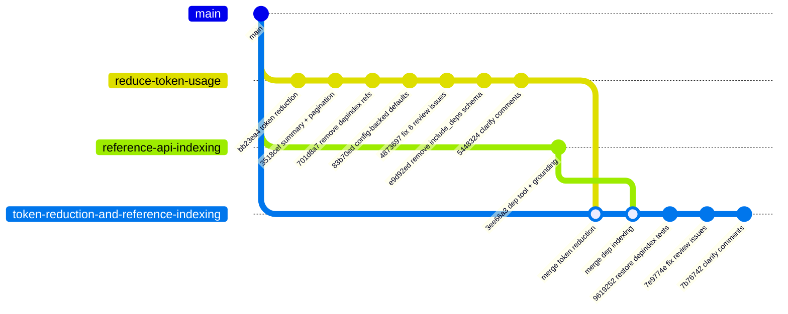
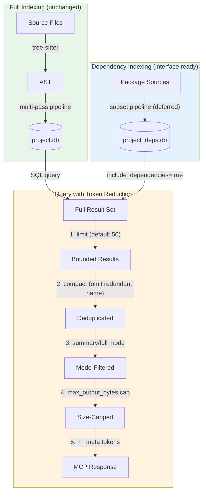
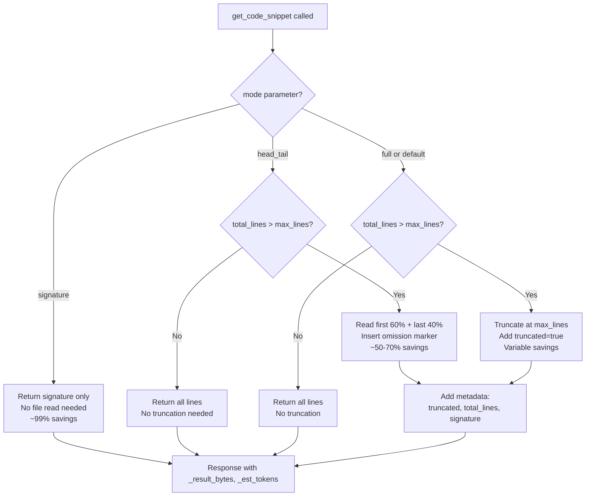
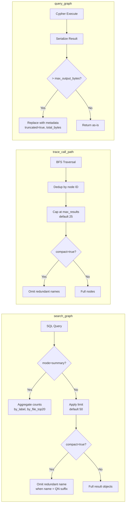

# Merged Branch Changes (`token-reduction-and-reference-indexing`)

## Overview

This branch combines both feature branches into a single branch with all capabilities:
- **Token reduction** (from `reduce-token-usage`) -- 8 RTK-inspired strategies reducing output tokens by 72-99%
- **Reference API indexing** (from `reference-api-indexing`) -- dependency source indexing with AI grounding infrastructure

## Branch Lineage



## Changed Files (vs main)

| File | Insertions | Deletions |
|------|-----------|-----------|
| `src/mcp/mcp.c` | 446 | 54 (net) |
| `tests/test_token_reduction.c` | 826 | 0 (new) |
| `tests/test_depindex.c` | 486 | 0 (new) |
| `tests/test_main.c` | 8 | 0 |
| `Makefile.cbm` | 6 | 1 |
| `src/cypher/cypher.c` | 1 | 1 |
| `src/store/store.c` | 3 | 2 |
| **Total** | **1,725** | **54** |

## Commits (9)

```
7b76742 mcp.c: clarify code comments for token metadata, pagination, head_tail
7e9774e mcp.c: fix 6 issues found in code review
9619252 Makefile.cbm, test_main.c: restore depindex test suite on merged branch
83b70ed mcp: config-backed defaults + magic-number-free tool descriptions
701d8a7 Makefile.cbm, test_main.c: remove depindex refs from token-reduction branch
3518cef mcp: fix summary mode aggregation limit + add pagination hint
a6cfc88 mcp: fix summary mode aggregation limit + add pagination hint
3ee66a3 mcp: add index_dependencies tool + AI grounding infrastructure
bb23ea4 mcp: reduce token consumption via RTK-inspired filtering strategies
```

## Combined Capabilities

### Token Reduction Features

| Feature | Parameter | Default | Savings |
|---------|-----------|---------|---------|
| Default limits | `limit` | 50 | 99.6% |
| Signature mode | `mode="signature"` | -- | 99.4% |
| Head/tail mode | `mode="head_tail"` | -- | 50-70% |
| Summary mode | `mode="summary"` | -- | 99.8% |
| Compact mode | `compact=true` | false | 72.7% |
| Output cap | `max_output_bytes` | 32KB | Caps worst case |
| Token metadata | `_result_bytes`, `_est_tokens` | Always | Awareness |

### Dependency Indexing Features

| Feature | Parameter | Default | Status |
|---------|-----------|---------|--------|
| Index deps | `index_dependencies` tool | -- | Interface only |
| Query deps | `include_dependencies` | false | Ready for deps |
| Source field | `"source":"project/dependency"` | project | Ready |
| QN prefix | `dep.{mgr}.{pkg}.{sym}` | -- | Designed |

## Combined Architecture



## Snippet Mode Decision Flow



## Token Reduction Pipeline (per query tool)



## Test Coverage

| Suite | Tests | Lines | Branch |
|-------|-------|-------|--------|
| `suite_token_reduction` | 22 | 826 | reduce-token-usage |
| `suite_depindex` | 12 | 486 | reference-api-indexing |
| **Both** | **34** | **1,312** | merged |

Plus all existing upstream tests (~2,030).

## Merge Conflicts Resolved

- `src/mcp/mcp.c` TOOLS[] array -- both branches added entries; combined in merged branch
- `src/mcp/mcp.c` tool dispatch -- both branches added `strcmp()` entries; combined
- `tests/test_main.c` -- both branches added `extern` + `RUN_SUITE`; combined
- `Makefile.cbm` -- both branches added test source vars; combined

## Known Issues

- `index_dependencies` handler returns `not_yet_implemented` (pipeline deferred)
- `include_dependencies` accepted but no-op until deps are indexed
- Summary mode aggregation capped at 10,000 results
- `limit=0` maps to 500,000 in store.c (upstream behavior)
- CONTRIBUTING.md still references Go build system (upstream responsibility)
