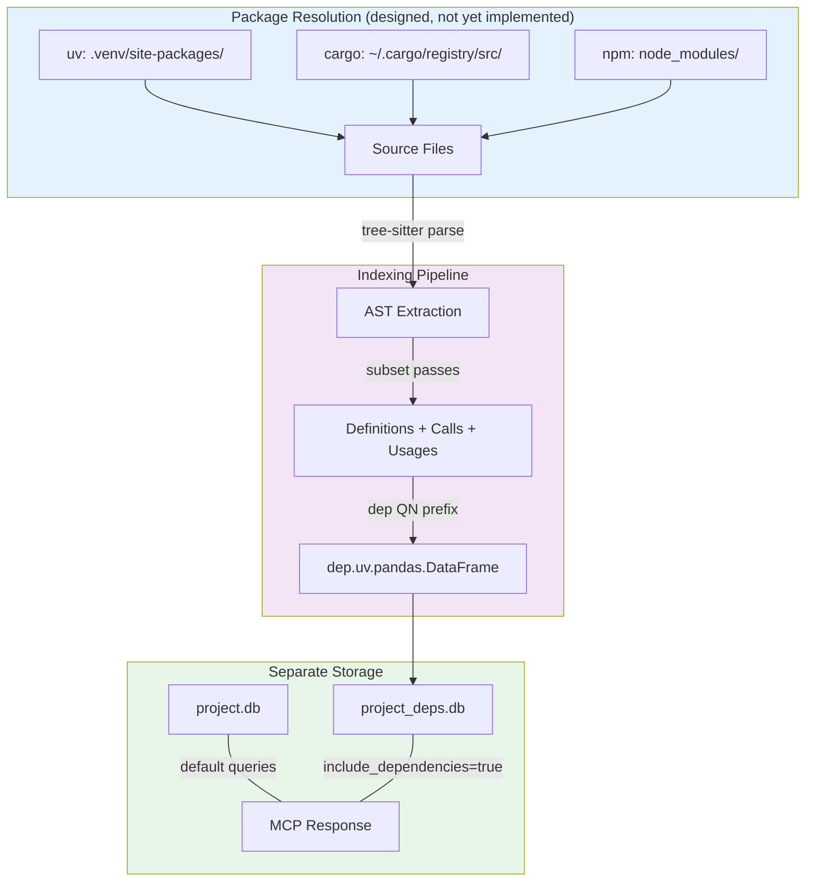

# Reference API Indexing Changes (branch: `reference-api-indexing`)

## Overview

Adds the ability to index dependency/library source code (Python/uv, Rust/cargo, JS-TS/npm/bun) into a **separate** dependency graph for API reference. This allows AI agents to see correct API usage patterns from library source code while maintaining clear separation between project code and dependency code.

## Changed Files

| File | Change |
|------|--------|
| `src/mcp/mcp.c` | `index_dependencies` tool + `include_dependencies` param on query tools |
| `tests/test_depindex.c` | 12 new tests (486 lines) |
| `tests/test_main.c` | Register `suite_depindex` |
| `Makefile.cbm` | Add test source |

## Commits (1)

```
3ee66a3 mcp: add index_dependencies tool + AI grounding infrastructure
```

## New MCP Tool: `index_dependencies`

```json
{
  "project": "my-project",
  "package_manager": "uv|cargo|npm|bun",
  "packages": ["pandas", "numpy"],
  "public_only": true
}
```

Currently returns `not_yet_implemented` status -- the MCP interface and AI grounding infrastructure are in place, but the actual package resolution pipeline (`src/depindex/` module) is deferred.

## AI Grounding: 7-Layer Defense

Preventing AI confusion between project code and dependency code is the primary design concern. Seven layers of defense:

| Layer | Mechanism | Purpose |
|-------|-----------|---------|
| **Storage** | Separate `{project}_deps.db` | Physical isolation |
| **Query default** | `include_dependencies=false` | Deps invisible unless requested |
| **QN prefix** | `dep.uv.pandas.DataFrame` | Every dep symbol clearly labeled |
| **Response field** | `"source": "dependency"` | Explicit per-result marker |
| **Properties** | `"external": true` | Queryable metadata |
| **Tool description** | Schema says "SEPARATE dependency graph" | LLM reads this |
| **Boundary markers** | trace shows project->dep edges | Clear transition points |

## Query Integration

Existing query tools gain an `include_dependencies` boolean parameter (default `false`):

- `search_graph` -- when true, includes dep results with `"source":"dependency"`
- `trace_call_path` -- when true, marks project->dep boundary crossings
- `get_code_snippet` -- shows provenance (`"package":"pandas"`, `"external":true`)

## Architecture: Dependency Indexing Flow



## QN Prefix Format

Dependency symbols get a `dep.{manager}.{package}.{symbol}` prefix:

```
dep.uv.pandas.DataFrame.read_csv       (Python/uv)
dep.cargo.serde.Serialize              (Rust/cargo)
dep.npm.react.useState                 (JS/npm)
```

This prevents collisions even if the project has a module with the same name as a dependency.

## Deferred Work

The following components are **designed** (see plan file) but **not yet implemented**:

| Component | Purpose | Location |
|-----------|---------|----------|
| `src/depindex/depindex.c` | Package resolution (uv/cargo/npm/bun) | New module |
| `src/depindex/dep_discover.c` | Filtered file discovery for deps | New module |
| `src/depindex/dep_pipeline.c` | Subset pipeline for dep indexing | New module |
| Per-package re-indexing | Wipe only one dep's nodes on re-index | graph_buffer.c |
| `_deps.db` storage | Separate SQLite for dep nodes | store.c |

## Limitations

- `index_dependencies` tool is registered but returns `not_yet_implemented`
- No actual package source resolution yet
- `include_dependencies` parameter is accepted but has no effect until deps are indexed
- No per-package re-indexing isolation yet
