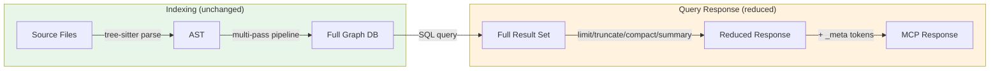

# Token Reduction Changes (branch: `reduce-token-usage`)

## Overview

RTK-inspired token reduction for codebase-memory-mcp MCP tool responses. Reduces output token consumption by 72-99% depending on mode, without affecting indexing completeness. All changes are **output-side only** -- the full codebase is still indexed and stored; only query responses are trimmed.

## Changed Files

| File | Change |
|------|--------|
| `src/mcp/mcp.c` | 8 token reduction strategies + config-backed defaults |
| `src/cypher/cypher.c` | `CYPHER_RESULT_CEILING` 100,000 -> 10,000 |
| `src/store/store.c` | Pagination `ORDER BY name, id` for stable ordering |
| `tests/test_token_reduction.c` | 22 new tests (826 lines) |
| `tests/test_main.c` | Register `suite_token_reduction` |
| `Makefile.cbm` | Add test source |

## Commits (7)

```
5448324 mcp.c: clarify code comments for token metadata, pagination, head_tail
e9d92ed mcp.c: remove include_dependencies schema from token-reduction branch
4873697 mcp.c: fix 6 issues found in code review
83b70ed mcp: config-backed defaults + magic-number-free tool descriptions
701d8a7 Makefile.cbm, test_main.c: remove depindex refs from token-reduction branch
3518cef mcp: fix summary mode aggregation limit + add pagination hint
bb23ea4 mcp: reduce token consumption via RTK-inspired filtering strategies
```

## Strategies Implemented

### 1. Sane Default Limits (RTK: "Failure Focus")

| Tool | Parameter | Before | After | Config Key |
|------|-----------|--------|-------|------------|
| `search_graph` | `limit` | 500,000 | 50 | `search_limit` |
| `search_code` | `limit` | 500,000 | 50 | `search_limit` |

Callers can still pass explicit higher limits. Config overrides via `codebase-memory-mcp config set search_limit 200`.

### 2. Smart Truncation for `get_code_snippet` (RTK: "Structure-Only" + "Failure Focus")

Three modes via the `mode` parameter:

| Mode | Behavior | Savings |
|------|----------|---------|
| `full` (default) | Full source up to `max_lines` (default 200) | Variable |
| `signature` | Signature, params, return type only | ~99% |
| `head_tail` | First 60% + last 40% with `[... N lines omitted ...]` | ~50-70% |

The `head_tail` mode preserves function signature (head) and return/cleanup code (tail), avoiding the dangerous blind-truncation problem where return types and error handling get silently cut.

### 3. Compact Mode (RTK: "Deduplication")

`compact=true` on `search_graph` and `trace_call_path` omits the `name` field when it's a suffix of `qualified_name`, saving ~15-25% per response.

### 4. Summary Mode (RTK: "Stats Extraction")

`mode="summary"` on `search_graph` returns aggregated counts instead of individual results:

```json
{"total": 347, "by_label": {"Function": 200, "Class": 50}, "by_file_top20": {...}}
```

Savings: ~99% (1,317 bytes vs hundreds of KB).

### 5. Trace BFS Limit + Edge Case Fixes

- Default `max_results` reduced from 100 to 25 (configurable via `trace_max_results`)
- BFS cycle deduplication via `seen_ids` array
- Ambiguous function names return `candidates` array with qualified names

### 6. query_graph Output Truncation (RTK: "Tree Compression")

`max_output_bytes` parameter (default 32KB) caps raw Cypher output. Replaces with a valid JSON metadata object (not mid-JSON truncation). Does NOT change `max_rows` which would break aggregation queries.

### 7. Token Metadata (RTK: "Tracking")

Every response includes `_result_bytes` and `_est_tokens` (bytes/4 heuristic) for context cost awareness.

### 8. Pagination Hint

When `has_more=true`, responses include a `pagination_hint` field guiding how to fetch the next page.

## Architecture: Token Reduction is Output-Side Only



## Config System

All defaults are runtime-configurable via `cbm_config_get_int()`:

| Config Key | Default | Controls |
|------------|---------|----------|
| `search_limit` | 50 | Default limit for search_graph/search_code |
| `snippet_max_lines` | 200 | Default max lines for get_code_snippet |
| `trace_max_results` | 25 | Default max results for trace_call_path |
| `query_max_output_bytes` | 32768 | Default byte cap for query_graph output |

## Real-World Results (RTK codebase, 45,388 symbols)

| Feature | Bytes | Savings |
|---------|-------|---------|
| Summary mode | 1,317 | 99.8% vs full |
| Compact mode | 611 vs 2,237 | 72.7% |
| Signature mode | 16 vs 2,489 | 99.4% |
| Default limit (50) | 50 results | 99.6% vs 13,818 |

## Limitations

- Summary mode caps at 10,000 results for aggregation (sufficient for most codebases)
- `max_lines=0` means unlimited, not zero lines
- `limit=0` in store.c maps to 500,000 (upstream behavior), NOT unlimited
- No tee mode (full-output recovery after truncation) -- would require file-based caching
